# No-Code Text Analysis

# 코드 없이 텍스트 분석하고 예측하기 🔍
## SageMaker Canvas 접속

1. AWS 콘솔에서 SageMaker > 도메인 클릭 > [사용자 프로필]탭 > 시작 > 캔버스를 클릭해 SageMaker Canvas로 접속합니다.

> 처음 Canvas에 접속한다면 Canvas applicatio을 생성하기까지 약 3~5분의 시간이 소요됩니다.

2. Canvas application 생성이 완료되었다면, 아래와 같은 화면으로 리다이렉트됩니다. 이번 실습에서는 "Skip for now"를 선택하겠습니다.

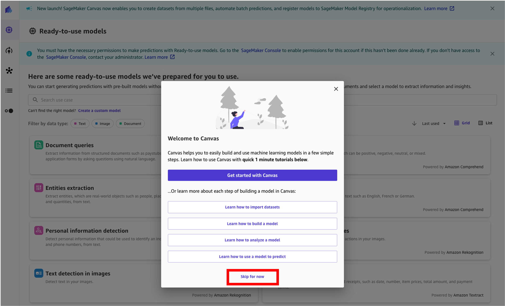

## Ready-to-use model 사용하기

SageMaker Canvas에서 제공하는 이미 학습이 되어 있는 자연어 처리 모델 (Nautral Language Processing Model)을 활용해보겠습니다.

### Dataset 업로드
예측 모델을 사용하기에 앞서, 예측 대상이 될 데이터셋(Dataset)을 Cavnas에 업로드해봅시다.

1. 데이터셋을 다운로드 합니다: [amazon-reviews-en.csv](https://stem-material.s3.ap-northeast-2.amazonaws.com/amazon-reviews-en.csv)

2. Canvas의 왼쪽 메뉴창에서 [Datasets]를 클릭합니다. 그리고, 오른쪽 상단의 [Create] > [Tabular]를 선택합니다.
   - 데이터셋의 이름은 `amazon-reviews-en`으로 하겠습니다.

3. 다운로드 받은 데이터셋을 업로드합니다. 정상적으로 업로드가 완료되었다면 [Create dataset] 버튼을 클릭합니다.

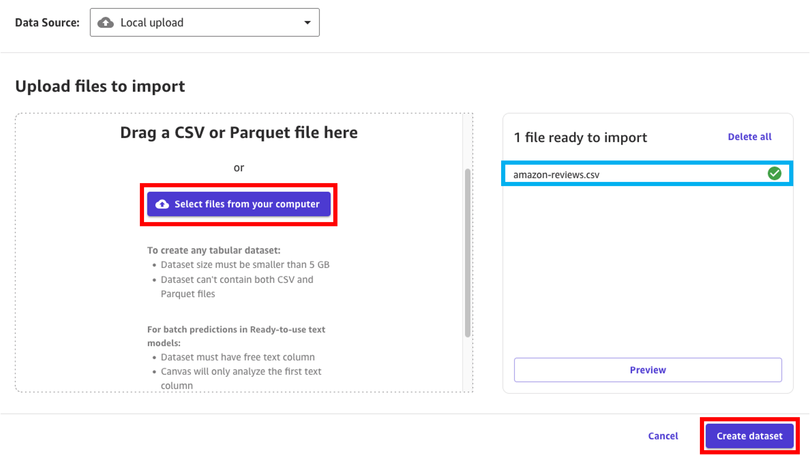

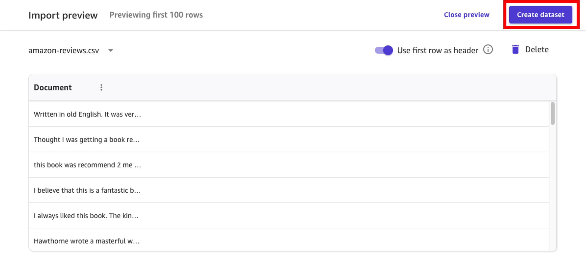

### Personal Information Detection (개인 정보 탐지)
텍스트에서 개인을 식별할 수 있는 개인 정보(e.g. 주소, 계좌 번호, 전화 번호 등)를 탐지하는 모델을 활용해 문장 속 개인 정보들을 탐지해봅시다.

1. 다시 [Ready-to-use models] 탭을 클릭하고, Per**sonal information detection** 모델을 선택합니다.

2. Single Prediction 에서는 문장을 입력하고 즉시 그 결과를 확인할 수 있습니다. 문장을 입력하고, [Generate prediction results] 버튼을 클릭하면, 입력한 문장 속 개인 정보 값들을 찾습니다.
   - confidence: 모델이 해당 예측 결과에 대해 얼마나 자신있는지 정확도를 가리킵니다.

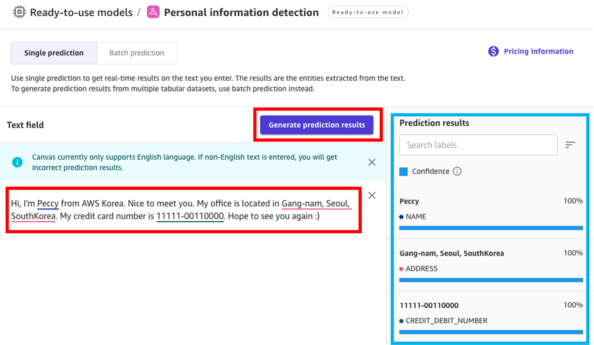

3. Batch Prediction 에서는 데이터셋을 이용해 더 많은 양의 데이터를 동시에 처리할 수 있도록 합니다. [Select dataset] 버튼을 클릭한 뒤, 앞서 생성했던 `amazon-reviews-en` 데이터셋을 선택합니다.

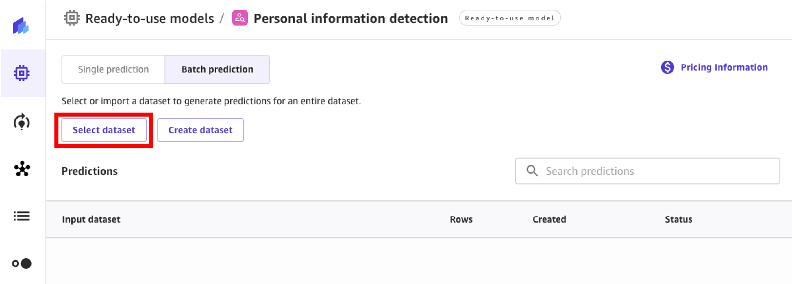

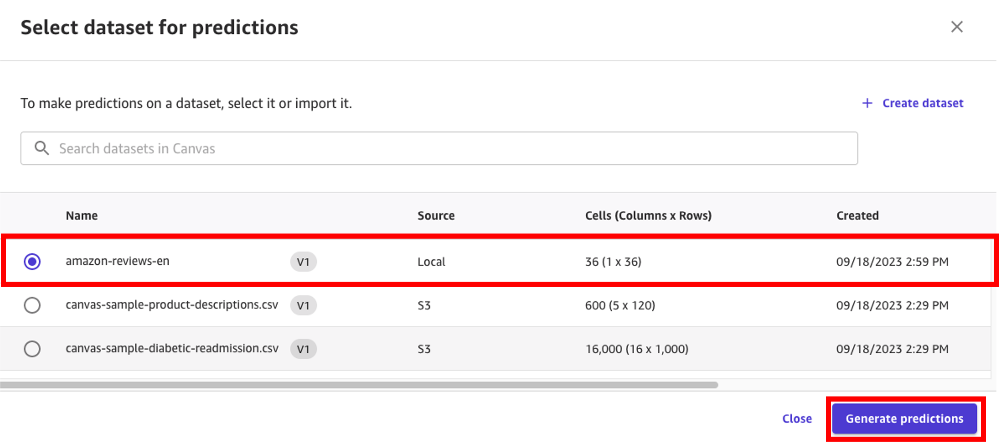

4. 예측 결과는 Input dataset 이름을 클릭하면 확인할 수 있습니다.

### Entities Extraction (엔티티 추출)

텍스트에서 현실 세계의 오브젝트 (e.g. 사람, 장소 등)나 단위(e.g. 날짜, 수량 등)를 인식하고 해당하는 값을 추출하는 모델을 활용해 문장 속 오브젝트와 단위들을 추출해봅시다.

1. [Ready-to-use models] 탭을 클릭하고, **Entities Extraction** 모델을 선택합니다.

2. Single prediction 에서 즉석으로 문장 속 오브젝트를 추출하고 예측한 결과를 확인할 수 있습니다. 자유롭게 문장을 작성해보고 예측 결과를 확인해봅시다.

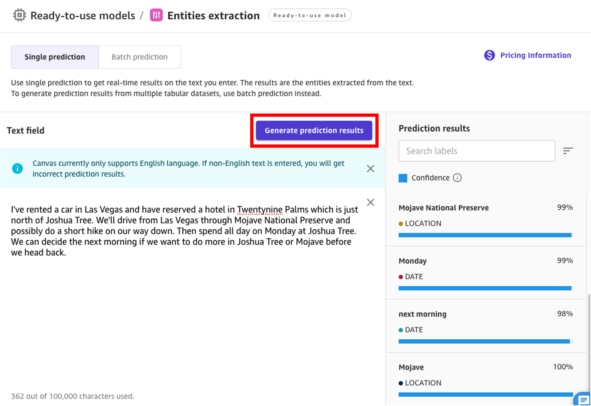

3. Batch prediction 에서는 데이터셋을 이용해 많은 양의 데이터를 동시에 처리할 수 있도록 합니다. 앞서 "Personal information detection"에서 사용한 데이터셋을 그대로 사용해봅시다. (데이터셋을 선택하는 부분을 직접 해봅시다!)

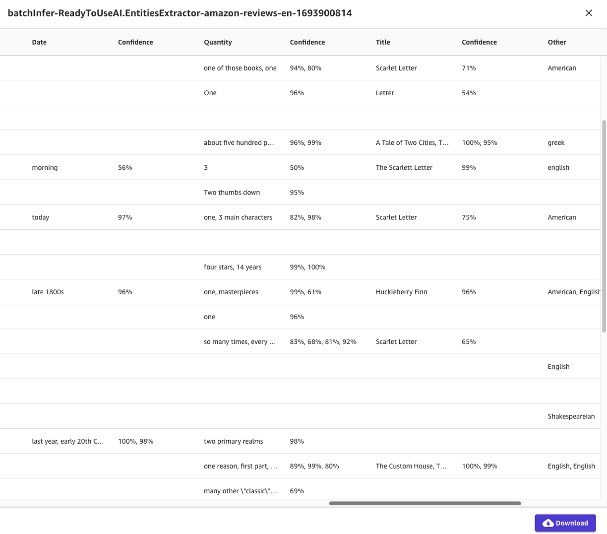

### Language Detection (언어 탐지)

텍스트의 주 언어가 무엇인지 분석하고 결정하는 모델을 활용해 문장의 언어를 확인해봅시다.

1. [Ready-to-use models] 탭을 클릭하고, **Language Detection** 모델을 선택합니다.

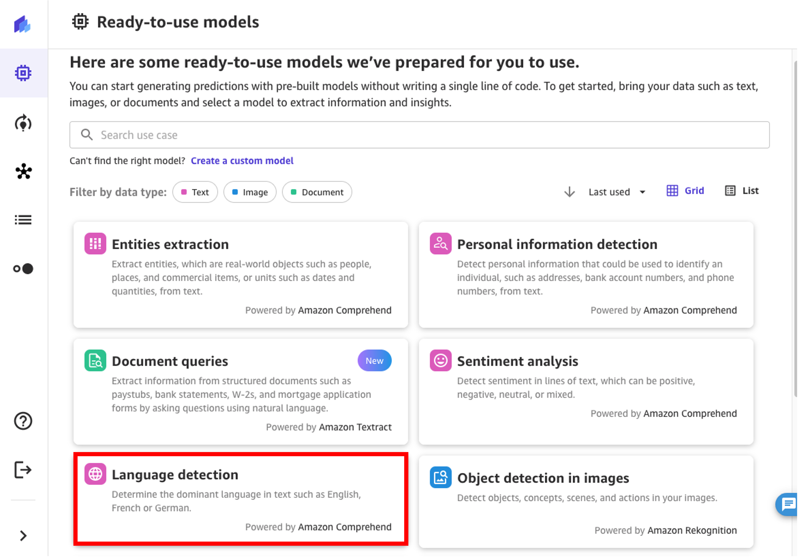

2. Single Prediction에서 여러 언어의 문장들을 작성해보고 문장의 주된 언어가 무엇인지 탐지한 결과를 확인해봅시다.
   - 문장 속에 여러 언어가 섞여 있다면, 그 중에서도 문장의 주된 언어가 무엇인지 결정합니다.
   - 예시 문장
       - `Bonjour, enchanté !` (French)
       - `Olá, prazer em conhecer você` (Portuguese)
       - `¡Hola, encantado de conocerte!` (Spanish)
       - `Hallo, sehr geehrter Empfang!` (German)
       - `こんにちは` (Japanese)
       - `Hi, Nice to meet you!` (English)

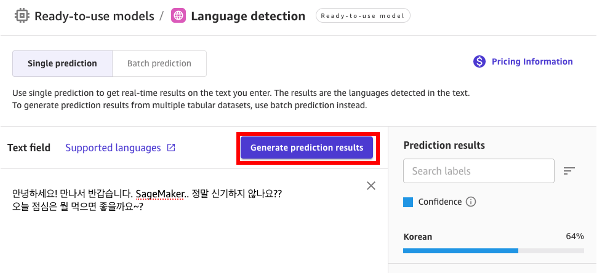

### Sentiment Anlaysis (분위기 분석)

텍스트 속 각 문장의 분위기를 탐지하는 모델을 활용하여, 해당 문장이 긍정적(positive)인지, 부정적(negative)인지, 중립적(neutral)인지, 복합적(mixed)인지 확인해봅시다.

1. [Ready-to-use models] 탭을 클릭하고, Sentiment Analysis 모델을 선택합니다.

2. Single Prediction 에서 몇 개의 문장을 적고 바로 그 문장의 분위기를 탐지할 수 있습니다.

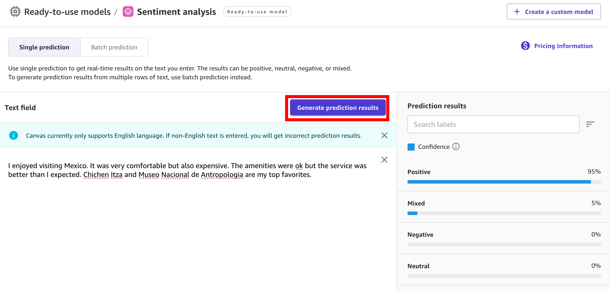

(한국어는 지원하지 않아 정확도는 떨어지지만 예측값을 확인할 수 있습니다)

3. Batch prediction 에서는 데이터셋을 이용해 많은 양의 데이터를 동시에 처리할 수 있도록 합니다. 앞서 "Personal information detection"에서 사용한 데이터셋을 그대로 사용해봅시다. (데이터셋을 선택하는 부분을 직접 해봅시다!)

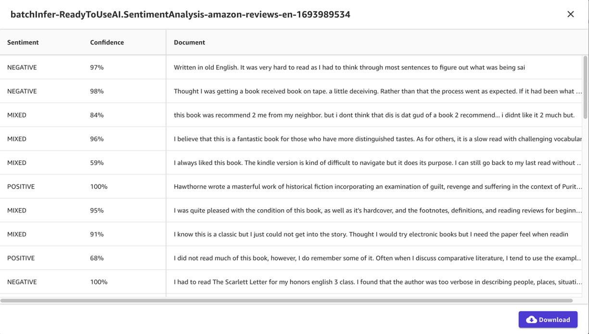

## Custom Natural Language Processing Model

이번에는 자연어로 된 텍스트 데이터셋을 분석하고 원하는 예측 값을 제공하는 NLP 모델을 직접 구성해봅시다.

1. 새로운 모델을 직접 만들어봅시다. [Ready-to-use models] 탭의 "Create a custom model"을 클릭하거나, [My models] 탭의 "+New model"을 클릭합니다. 새로운 모델에 대한 정보는 아래와 같이 설정합니다.
   - Model name: `Product Reviews Analysis` 입력
   - Problem type: `Text analysis` 선택

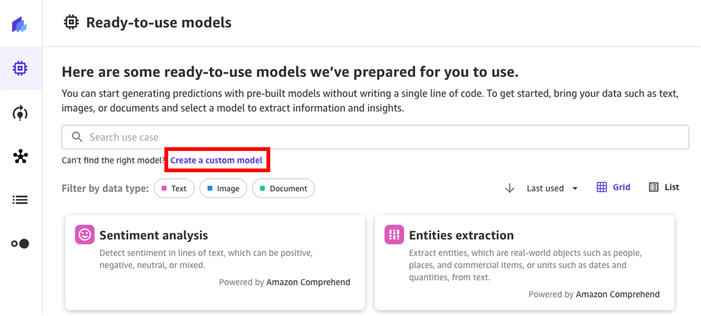

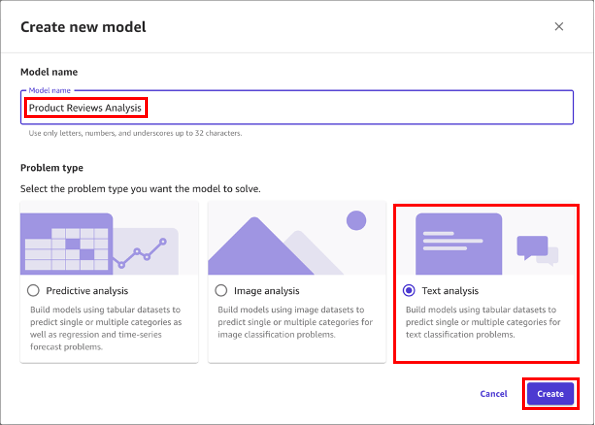

2. 데이터셋을 업로드하여 새로운 NLP 모델을 학습시킵니다. 아래의 데이터셋을 다운로드받고, Canvas에 업로드합니다. 
   - 데이터셋: [amazon_product_reviews_training.csv](https://stem-material.s3.ap-northeast-2.amazonaws.com/amazon_product_reviews_training.csv)
   - 데이터셋 이름: `amazon-product-reviews-training`

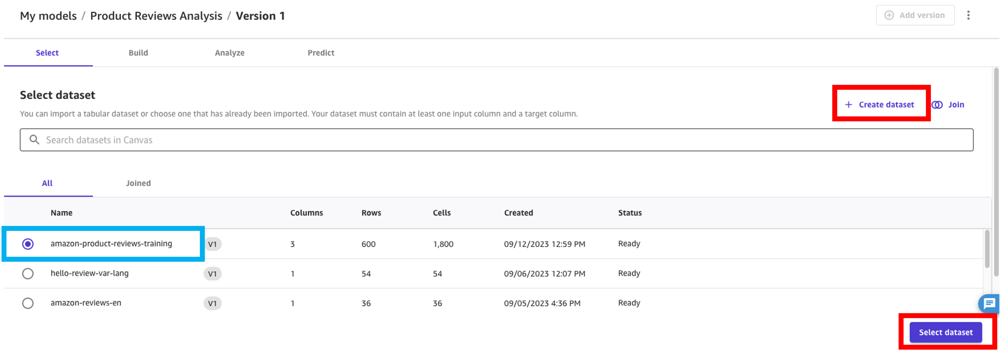

3. 학습을 위한 기준을 설정합니다. 기준을 설정한 뒤, [Quick build] 버튼을 클릭하여 주어진 데이터셋과 설정을 기반으로 새로운 모델을 훈련합니다.
   - Target column: `Category` 선택
     - 생성된 모델이 이후 새로운 데이터셋에 대하여 예측할 값을 의미합니다.
   - Source column: `Product_Review` 선택
     - 생성된 모델이 target을 예측하기 위해 참고하는 값을 의미합니다.

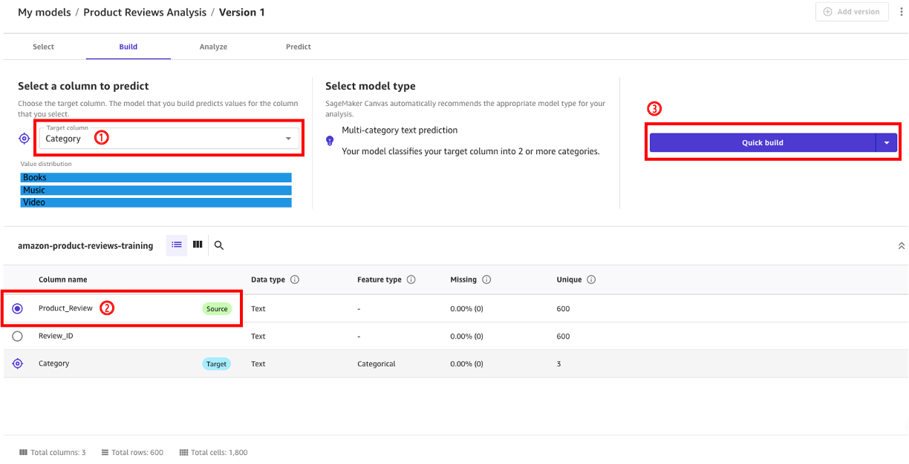

> 모델을 훈련하기까지 15~30분 정도의 시간이 소요됩니다.

4. 모델의 생성 및 학습이 완료되었습니다!

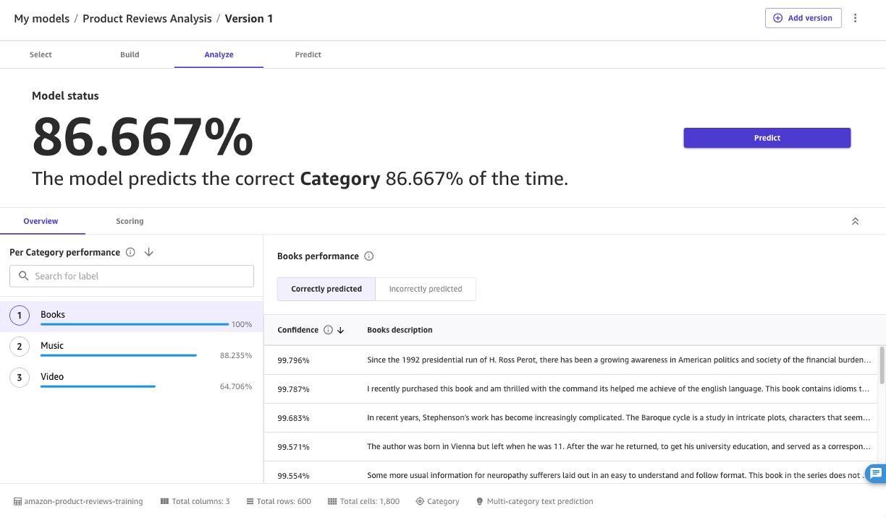

모델의 훈련 결과를 확인할 수 있습니다.

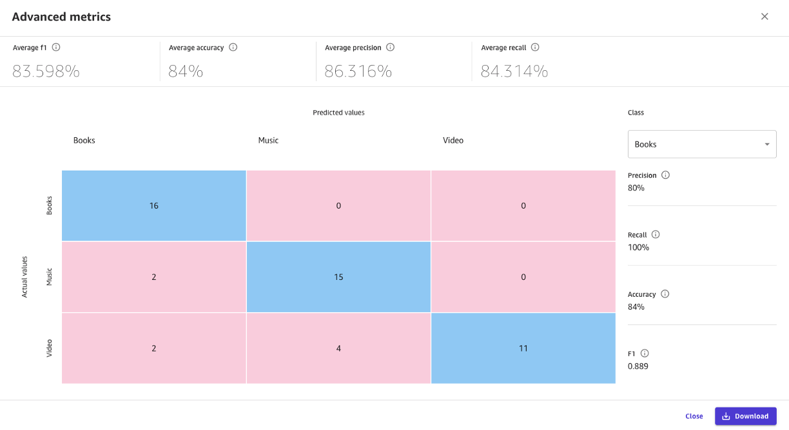

"Advanced metrics"를 통해 조금 더 자세히 예측값과 실제값을 비교한 수치를 확인할 수 있습니다.

5. 학습까지 완료한 모델을 이용하여 새로운 데이터셋에 대하여 예측 값을 만들어봅시다. 우선 새롭게 예측할 데이터셋을 다운로드 받고, Canvas에 업로드해 새로운 데이터셋을 생성합니다.
   - 데이터셋 다운로드: [amazon_product_reviews.csv](https://stem-material.s3.ap-northeast-2.amazonaws.com/amazon_product_reviews.csv)
   - 데이터셋 이름: `amazon-product-reviews`
   - 모두 설정하고 난 뒤, 해당 데이터셋을 선택하고 [Gerenate predictions] 버튼을 클릭합니다.

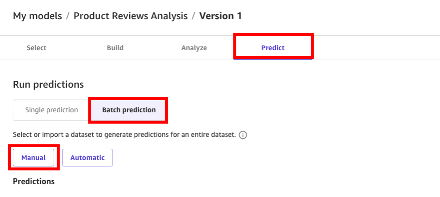

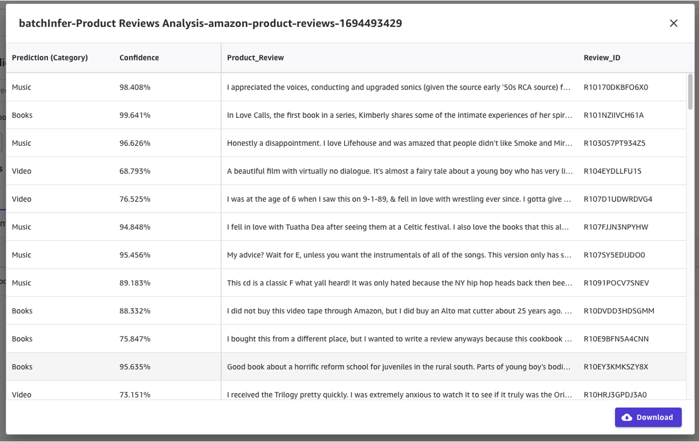

새로운 데이터셋의 Category 값을 예측했습니다!

# 자원 정리하기
## SageMaker Studio application 삭제하기
1. AWS 콘솔 > SageMaker > 도메인: 선택 > 사용자 프로필을 클릭 하면 사용자 세부 정보를 확인할 수 있고 원하는 앱을 선택하여 삭제할 수 있습니다.

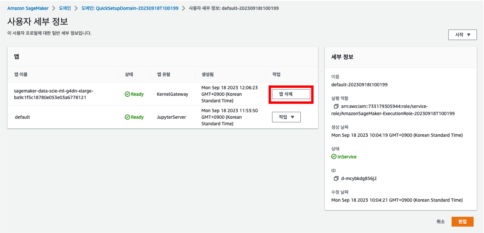

2. [앱 삭제] 버튼을 클릭하면, 앱 삭제를 위한 확인 창이 나타납니다. "**예, 앱을 삭제합니다**" 버튼을 클릭하면, 아래의 필드에 `삭제`를 입력하고, "**삭제**" 버튼을 클릭합니다.

3. 사용자 프로필에서 실행 중인 모든 앱을 삭제하고 나면, 사용자 프로필을 삭제할 수 있습니다. 앞서 앱을 삭제했던 페이지에서 모든 앱을 삭제하고 난 뒤, [편집] 버튼을 클릭합니다. [일반 설정] > [사용자 삭제] 탭의 [사용자 삭제] 버튼을 클릭합니다.

4. 사용자 프로필 삭제까지 마쳤다면, 도메인을 삭제합니다. SageMaker 도메인 리스트가 보이는 도메인 대시보드로 이동합니다. 그리고 삭제할 도메인을 선택한 뒤, [편집] 버튼을 클릭합니다. [일반 설정] > [도메인 삭제] 탭의 [도메인 삭제] 버튼을 클릭하면 도메인이 모두 삭제됩니다.

