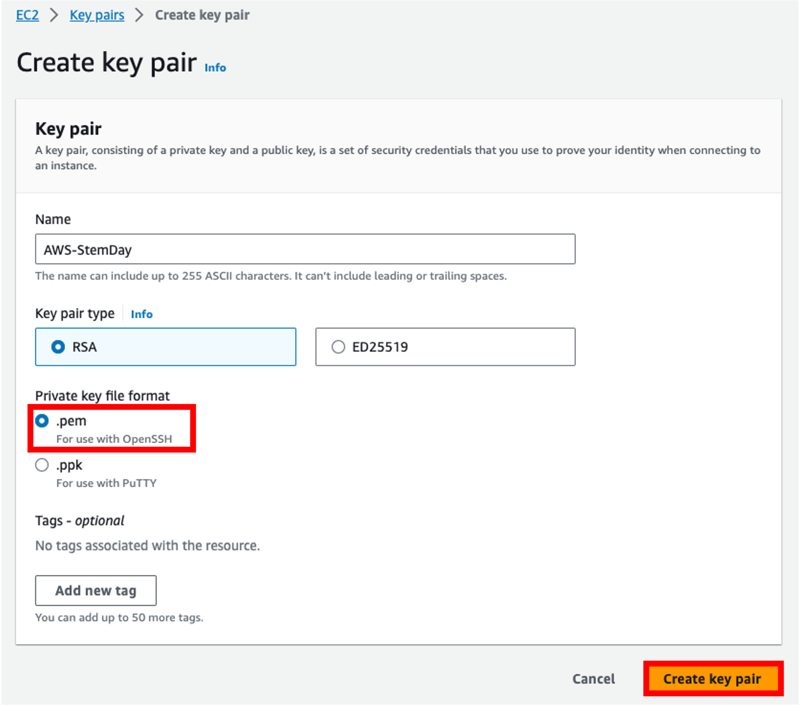
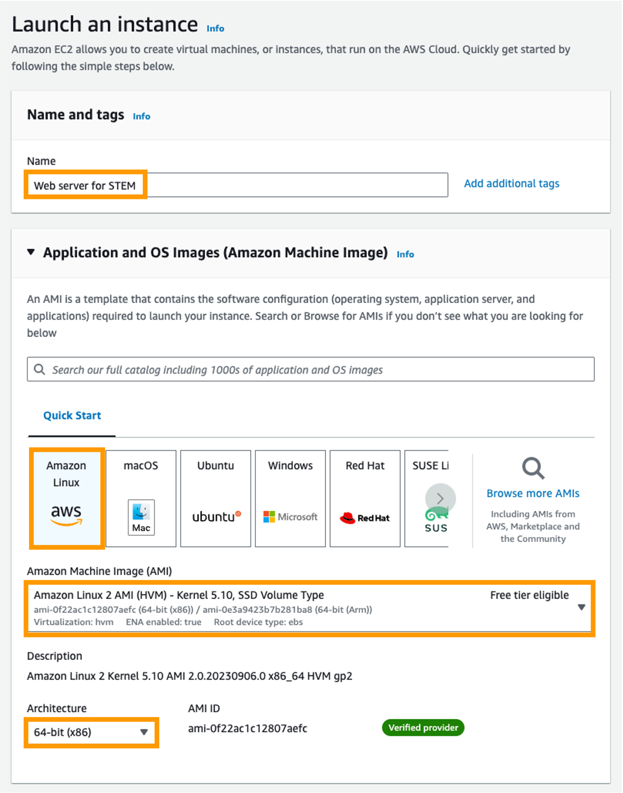
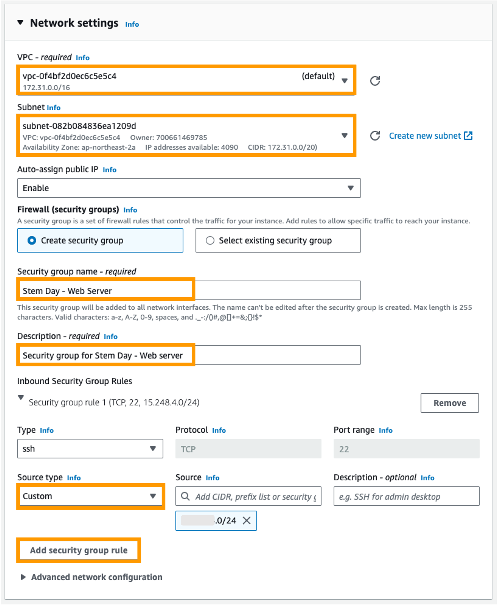
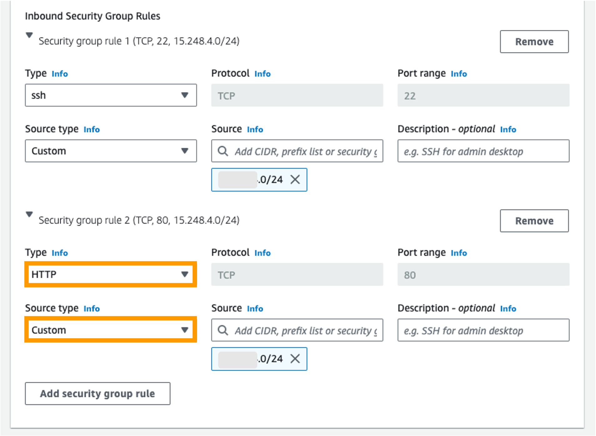
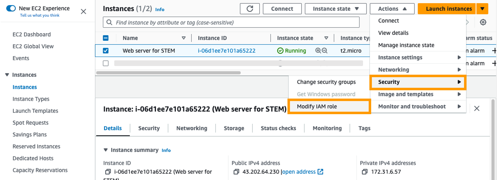
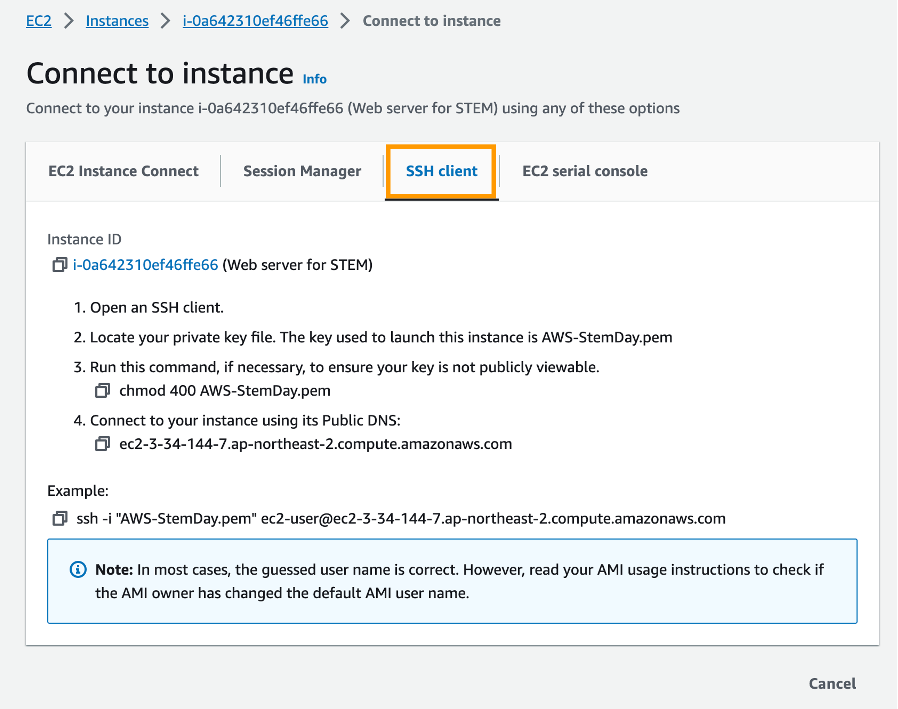
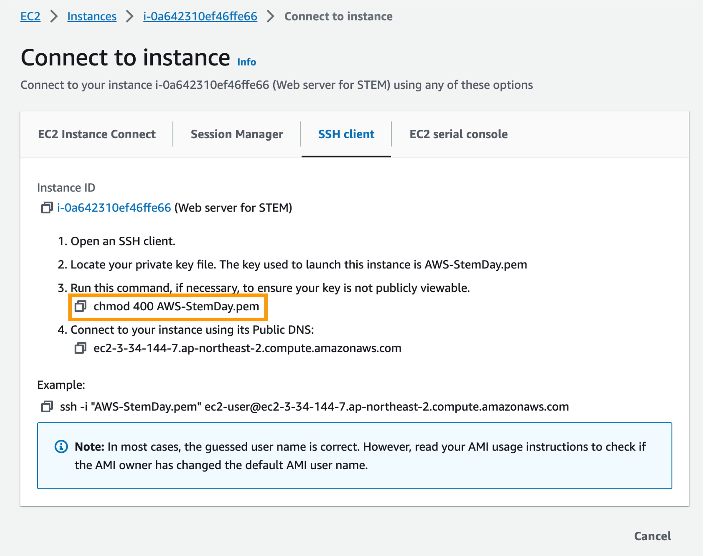
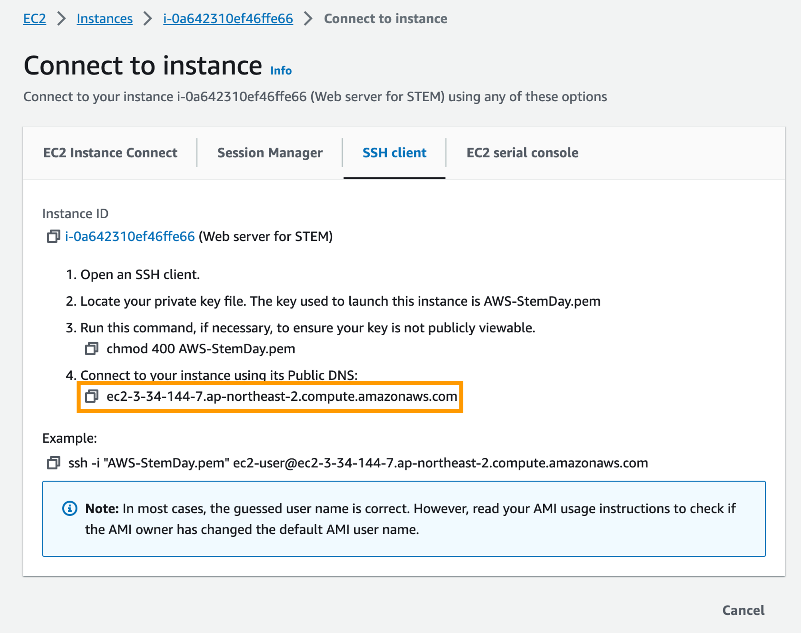

# 컴퓨트 - Amazon EC2


엔터프라이즈, 클라우드 네이티브 또는 모바일 애플리케이션을 구축하거나 대규모 클러스터를 실행하여 분석 워크로드를 구동하던 상관없이 조직의 구축 및 실행은 컴퓨팅에서 시작됩니다. AWS는 세계에서 가장 강력하고 안전하며 혁신적인 컴퓨팅 클라우드에서 애플리케이션과 워크로드를 개발, 배포, 실행 및 확장할 수 있는 포괄적인 [컴퓨팅 서비스](https://aws.amazon.com/products/compute/?nc1=h_ls) 포트폴리오를 제공합니다.


AWS 컴퓨팅 서비스들은 아래와 같은 특징을 가지고 있습니다:

- 고객의 워크로드에 적합한 컴퓨팅
- 아이디어에서 프로덕션 출시까지 걸리는 시간 가속화
- 빌트인 보안 제공
- 비용 최적화를 위한 유연성
- 필요한 위치에 컴퓨팅 서비스 제공

---

# EC2 Linux 실습
## Amazon EC2에 대하여

[Amazon EC2](https://docs.aws.amazon.com/AWSEC2/latest/UserGuide/concepts.html) 는 AWS 클라우드에서 확장 가능한 컴퓨팅 용량을 제공합니다. Amazon EC2를 사용하면 하드웨어 선투자할 필요가 없어 더 빠르게 애플리케이션을 개발하고 배포할 수 있습니다. Amazon EC2를 통해, 원하는 만큼 가상 서버를 구축하고 보안 및 네트워크 구성과 스토리지 관리가 가능합니다. 또한, Amazon EC2는 갑작스러운 트래픽 증가와 같은 변동 사항에도 신속하게 규모를 확장하거나 축소할 수 있어 서버 트래픽 예측 필요성이 줄어듭니다.


아래의 순서 대로 실습을 진행하면서 웹 서버를 직접 구성합니다:

1. 키페어 생성하기
2. 웹 서버 인스턴스 생성하기
3. 리눅스 인스턴스에 접근하기
4. (옵션) Session Manager를 사용하여 리눅스 인스턴스에 접근하기
5. (옵션) PuTTy를 사용해서 리눅스 인스턴스에 접근하기

---

# 키페어 생성하기
## 키페어 생성하기

이 실습에서는 SSH 키 쌍을 사용하여 EC2 인스턴스를 생성해야 합니다. 다음 단계에 따라 이 실습에서 사용할 고유한 SSH 키 쌍을 생성할 수 있습니다.

1. AWS 관리 콘솔에 로그인하고 [Amazon EC2 콘솔](https://console.aws.amazon.com/ec2)을 엽니다. AWS 관리 콘솔의 오른쪽 상단 모서리에서 원하는 AWS 리전에 있는지 확인합니다.

2. 왼쪽 메뉴 하단의 네트워크 및 보안 섹션에서 **Key Pairs**를 클릭합니다. SSH 키 쌍을 관리하는 페이지가 표시됩니다. 

   

3. 새 SSH 키 페어를 생성하려면 브라우저 창의 맨 위에 있는 **키 쌍 만들기** 버튼을 클릭합니다. 

   

4. Key Pair Name: 텍스트 상자에 **[Your Name]-StemDay**를 입력하고 **Create key pair** 버튼을 클릭합니다. Windows 사용자의 경우 파일 형식에 대해 **ppk**를 선택하십시오.

5. 웹 브라우저에서 **[Your Name]-StemDay.pem** 파일을 로컬 드라이브에 다운로드합니다. 브라우저 지침에 따라 파일을 기본 다운로드 위치에 저장합니다. 방금 다운로드한 키페어 파일의 전체 경로를 기억하십시오.

> 방금 생성한 키페어를 사용하여 나머지 실습에서 진행하는 EC2 인스턴스를 관리합니다.

---

# 웹 서버 인스턴스 생성하기
## 웹 서버 인스턴스 생성하기

Amazon Linux 2 인스턴스를 시작하고, Apache/PHP를 부트스트랩하고, 우리의 인스턴스에 대한 정보를 표시할 기본 웹 페이지를 생성합니다.

1. 맨 왼쪽 메뉴 상단에서 **EC2 Dashboard**를 클릭합니다. 그리고 **Launch 인스턴스**를 클릭합니다. 
   
   

2. **Name**에 **`Web server for STEM`** 값을 넣습니다. 그리고 아래의 Amazon Machine Image에서 화면과 같이 기본 값 설정을 확인합니다. 
   
   

3. Instance Type 에서 **t2.micro**를 선택합니다. 
   
   

4. 앞선 실습에서 생성한 key pair를 선택합니다. 
   
   

5. EC2가 위치할 공간을 설정하는 Network setting에서 Edit 버튼을 클릭합니다. 

   

   **default VPC** 및 **subnet**을 확인합니다. **Auto-assign public IP**는 **Enable**로 설정합니다. 바로 아래에서 네트워크 방화벽 역할을 하는 **Security groups**를 생성합니다. 보안 그룹은 방화벽 정책으로 허용하고자 하는 프로토콜과 주소를 지정하게 됩니다. 현재 생성하는 보안 그룹의 경우, 생성될 EC2에 적용되는 규칙입니다. Security group name과 Description에 `Stem Day - Web Server`를 입력 후, Add Security group rule을 선택합니다. 

   

   Type에 HTTP 를 지정하여 Web Service를 위한 TCP/80도 함께 허용합니다. 소스 주소에서 **My IP**를 선택하여 MyIP를 확인한 뒤, **Custom**으로 다시 선택하고 '/24' 대역으로 설정합니다: 즉, MyIP가 1.2.3.4/32 였다면 **Custom**을 선택한 뒤 `1.2.3.0/24`로 수정합니다.
   
   

1. 나머지 모든 값들은 기본값을 사용하고, 화면 하단의 **Advanced Details** 탭을 클릭하여 확장하십시오. **User data** 입력란에 아래의 값을 입력 후, **Launch instance** 를 선택 하십시오. 
   
   

    

```sh
#!/bin/sh

# Install a LAMP stack
amazon-linux-extras install -y lamp-mariadb10.2-php7.2 php7.2
yum -y install httpd php-mbstring

# Start the web server
chkconfig httpd on
systemctl start httpd

# Install the web pages for our lab
if [ ! -f /var/www/html/immersion-day-app-php7.tar.gz ]; then
   cd /var/www/html
   wget https://aws-joozero.s3.ap-northeast-2.amazonaws.com/immersion-day-app-php7.tar.gz  
   tar xvfz immersion-day-app-php7.tar.gz
fi

# Install the AWS SDK for PHP
if [ ! -f /var/www/html/aws.zip ]; then
   cd /var/www/html
   mkdir vendor
   cd vendor
   wget https://docs.aws.amazon.com/aws-sdk-php/v3/download/aws.zip
   unzip aws.zip
fi

# Update existing packages
yum -y update
```

7. EC2 인스턴스 목록을 보려면 화면 오른쪽 아래에 있는 View Instance 버튼을 클릭합니다. 인스턴스가 시작되면 웹 서버와 인스턴스가 있는 가용 영역, 공개적으로 라우팅할 수 있는 DNS 이름이 표시됩니다. 이 EC2 인스턴스에 대한 세부 정보를 보려면 웹 서버 옆에 있는 확인란을 클릭하십시오. 
   
   

## 웹 서버 살펴보기
인스턴스가 상태 검사를 통과하여 로드가 완료될 때까지 기다립니다. 새 브라우저 탭을 열고 EC2 인스턴스의 **Public DNS name**을 브라우저에 입력하여 웹 서버를 찾습니다. EC2 인스턴스의 공용 DNS 이름은 위에서 강조 표시된 **Public IPv4 DNS** 이름 줄을 검토하여 콘솔에서 찾을 수 있습니다. 다음과 같은 웹 페이지를 확인할 수 있습니다. 

   

#### **잘하셨습니다! 몇 분 만에 서버를 배포하고 웹 사이트를 시작했습니다!**

---

# (옵션) Session Manager를 사용하여 리눅스 인스턴스에 접근하기

Session Manager는 대화형 원클릭 브라우저 기반 셸 또는 AWS CLI를 통해 Amazon EC2 인스턴스를 관리할 수 있는 AWS Systems Manager의 기능입니다. Session Manager를 사용하여 계정의 인스턴스에 세션을 시작할 수 있습니다. 세션이 시작된 후, 다른 연결 유형을 통해 bash 명령을 실행할 수 있습니다.

## Systems Manager를 위한 IAM 인스턴스 프로파일 생성

1. AWS 콘솔창에 접속한 후 [IAM 콘솔](https://console.aws.amazon.com/iam/) 
을 엽니다. 네비게이션 항목에서 **Roles**를 선택한 후, **Create role**을 클릭합니다. 

   

   

2. **Select type of trusted entity**에서 **AWS service**를 선택합니다. 바로 아래에 이 role을 사용할 서비스인 **EC2**를 선택합니다. 그리고 **Next** 버튼을 클릭합니다. 

   

3. 해당 IAM Role에 부착할 IAM Policy를 선택하는 페이지에서 아래와 같은 작업을 수행합니다: 검색바를 사용하여 **AmazonSSMManagedInstanceCore**를 찾은 다음, select box를 클릭한 후, **Next**를 클릭합니다. 

   

4. **Role name**에 **SSMInstanceProfile**를 입력합니다. **Create role**를 클릭합니다. 그러면 **Roles** 창으로 돌아오게 됩니다. 

   

> 방금 생성한 Role 이름을 기록합니다. Systems Manager를 사용하여 관리할 인스턴스에 해당 Role을 부여합니다.

## 기존의 인스턴스에 Systems Manager 인스턴스 프로파일 부착 (콘솔)

1. AWS 콘솔창에 접속한 후, [Amazon EC2 콘솔](https://console.aws.amazon.com/ec2)을 엽니다.

2. 네비게이션 항목에서 **Instances** 아래에 **Instances**를 선택합니다. 실습 때 생성한 EC2 인스턴스를 클릭합니다. **Actions** 메뉴에서 **Security** 선택 후, **Modify IAM role**를 클릭합니다. 

   

3. IAM Role에서 방금 생성한 **SSMInstanceProfile** 인스턴스 프로파일을 선택합니다. 

   

## Session Manager를 사용하여 리눅스 인스턴스 연결하기

1. EC2 인스턴스 콘솔에서 방금의 인스턴스를 선택한 후, **Connect** 버튼을 클릭합니다. 

   

2. **Connect to instance** 페이지에서 **Session Manager**를 선택합니다. 아래의 내용을 참고하세요. 

   

3. Session Manager 사용에 대한 이점이 담겨있는 **Session Manager usage section** 내용을 검토합니다.

4. **Connect** 를 선택합니다. 새로운 세션이 새로운 탭에서 시작될겁니다. 세션이 시작된 후, bash command를 실행할 수 있습니다. 

   

   > 만약 아래와 같은 에러가 발생할 경우, 수초를 기다린 후, 브라우저를 리프레시합니다. EC2 인스턴스가 Session Manager를 사용하기 위한 준비를 하고 있기 때문입니다. 혹은 앞선 페이지에서 인스턴스를 클릭한 후, **Instance State** 메뉴를 선택한 후, **Reboot instance**를 클릭합니다.

   

---

# 리눅스 인스턴스에 접근하기
## 리눅스 인스턴스에 접근하기

> Linux 인스턴스에 연결하기 위해 SSH 클라이언트를 사용합니다. Windows 사용자의 경우, **PuTTy를 사용하여 Linux 인스턴스에 연결**섹션을 참고합니다. Mac 사용자의 경우 터미널을 사용합니다.

1. EC2 인스턴스 콘솔에서 연결할 인스턴스를 선택한 다음 **Connect** 버튼을 클릭합니다. 

   

2. Connect to instance 페이지에서 **SSH client** 탭을 누릅니다. 아래 적혀있는 가이드를 따라합니다. 
   

3. Private key가 있는 로컬 디렉토리 위치로 이동하고 다음 명령을 입력합니다. 키를 만들 때 지정한 이름으로 **[Your Name]** 을 바꿉니다. 
   

```sh
chmod 400 [Your Name]-StemDay.pem
```

4. 그 다음, SSH 클라이언트에서 리눅스 인스턴스에 접근하기 위해 아래의 명령어를 수행합니다. 

   

```sh
ssh -i "[Your Name]-StemDay.pem" ec2-user@<Public IPv4 DNS>
```

5. 연결을 계속 진행할 것인지 묻는 질문에 yes라고 대답한 후, 아래와 같은 결과를 확인할 수 있습니다. 

   

---

# (옵션) PuTTy를 사용해서 리눅스 인스턴스에 접근하기

## PuTTy를 사용해서 리눅스 인스턴스에 접근하기

1. PuTTy를 시작합니다.

2. **Category** 창에서 **Session**을 선택합니다.

3. **Host Name**에 **ec2-user@[생성한 EC2의 public IP]** 를 입력합니다.

4. **Port**는 22번을 선택합니다.

5. **Connection type**은 **SSH**를 선택합니다. 


6. **Category** 창에서 **Connection** 항목을 확장시키고, 그 아래에 있는 **SSH**를 확장시킵니다. 그리고 **Auth**를 선택합니다. 아래의 지침을 수행하세요.

- Browse 선택.
- 키페어 생성시 만들었던 .ppk 파일 선택 후, Open 클릭.

7. 해당 인스턴스에 처음 연결한 경우 PuTTY에는 연결하려는 호스트를 신뢰하는지 묻는 보안 경고 대화 상자가 표시됩니다. **Yes**를 선택합니다. 창이 열리고 **ec2-user**로 인스턴스에 연결됩니다.

---

# 실습 자원 삭제하기
## 자원 정리

생성한 EC2 인스턴스를 삭제하려면 이 실습에서 생성한 인스턴스를 선택합니다. 인스턴스 상태 메뉴에서 **Terminate instance**를 선택합니다. 


해당 인스턴스를 종료할지 묻는 팝업 창이 나타납니다. **Terminate**를 누릅니다. 

