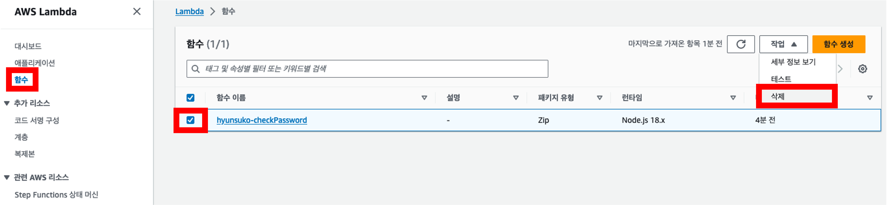

# Game Day

**AWS와 함께 자신만의 게임을 만들 시간입니다!** 간단한 방탈출 게임을 만드는 과정 속에서 정적 웹 호스팅이란 무엇인지, S3로 어떻게 정적 웹 호스팅을 수행할 수 있는지 학습합니다. 또한 Lambda를 활용해 비밀번호를 확인하는 로직을 구현해 봅니다.

## S3 정적 웹 호스팅

1. 웹 콘솔로 이동하여 s3를 검색하고 선택합니다.
2. **버킷 만들기**를 클릭하여 버킷을 생성합니다.


3. 버킷 이름에 **본인 영문 이름-aws-kr-stem-game-day**를 입력합니다.


4. 다른 설정은 기본값에서 변경하지 않고 하단의 **버킷 만들기**를 클릭합니다.


5. [링크](https://aws-kr-stem-game-day-files.s3.amazonaws.com/s3.zip)를 클릭하여 실습에 필요한 파일들을 다운로드 받습니다.
6. 다운로드 받은 s3.zip의 압축을 풉니다.
7. 생성한 버킷의 객체 탭에서 **업로드**를 선택하고, s3 디렉터리(폴더) 내 모든 파일들을 업로드합니다.


7. 생성된 버킷의 **권한** 탭을 클릭하여 이동합니다.
8. **퍼블릭 액세스 차단(버킷 설정)**의 **편집**을 클릭합니다.


9. 체크박스를 클릭하고 체크표시가 사라졌는지 확인하여 **모든 퍼블릭 액세스 차단**을 **해제**합니다.
10. **변경 사항 저장**을 클릭합니다.


11. 이어서 **권한** 탭에서 **버킷 정책**의 **편집**을 클릭합니다.


12. 아래 json 내용을 복사 및 붙여넣기하고 **변경 사항 저장**을 클릭합니다. (버킷ARN은 arn:aws:s3:::XXXXXX 형식입니다.)
```json
{
  "Id": "Policy1695189061014",
  "Version": "2012-10-17",
  "Statement": [
    {
      "Sid": "Stmt1695189059123",
      "Action": [
        "s3:GetObject"
      ],
      "Effect": "Allow",
      "Resource": "버킷ARN/*",
      "Principal": "*"
    }
  ]
}
```


13. 버킷의 **속성** 탭을 클릭하여 이동합니다.


14. 하단 **정적 웹 사이트 호스팅**의 **편집**을 클릭합니다.


15. 정적 웹 사이트 호스팅 **활성화**를 선택합니다.


16. 인덱스 문서에 **index.html**을 입력합니다.


17. **변경 사항 저장**을 클릭합니다.


18. 버킷의 **객체** 탭을 클릭하여 이동합니다. 
19. **hints/** 폴더를 클릭합니다.


20. 폴더 내 **.txt 확장자를 가진 텍스트 파일**을 체크하고 **작업**을 클릭, 이어서 **메타데이터 편집**을 클릭합니다.


21. **메타데이터 추가**를 클릭합니다.


22. 유형에서 **시스템 정의**를 선택합니다.
23. 키에서 **Content-Type**을 선택합니다.
24. 값에서 **text/plain; charset=utf-8**을 입력합니다.
25. **변경 사항 저장**을 클릭합니다.


26. 버킷의 **속성** 탭 하단 정적 웹 호스팅의 버킷 웹 사이트 엔드포인트 **링크**를 클릭하여 방탈출 게임이 제대로 배포되었는지 확인합니다. 


## Lambda 서버리스 컴퓨팅
1. 웹 콘솔로 이동하여 lambda를 검색하고 선택합니다.
2. **함수 생성**을 클릭합니다. (또는 좌측 **☰**를 클릭하고 아어서 **함수**, **함수 생성**을 연이어 클릭합니다.) 


3. 상단에서 **새로 작성**을 선택합니다.
4. 함수 이름에 **본인 영문 이름-checkPassword**를 입력합니다.
5. 런타임은 **Node.js 20.x**을 선택합니다.
6. 아키텍처는 **x86_64**를 선택합니다.

7. 하단 고급 설정 탭을 열고 **함수 URL 활성화**, **NONE**, **교차 출처 리소스 공유(CORS) 구성**을 선택합니다.
8. **함수 생성**을 클릭합니다.


9. 함수의 **코드** 탭에서 **index.mjs**를 확인합니다.
10. [링크](https://aws-kr-stem-game-day-files.s3.amazonaws.com/lambda.js)를 클릭하여 실습에 필요한 코드를 **복사**하여 **index.mjs** 내에 **붙여넣기**합니다.
11. **Deploy**를 클릭하여 함수를 업데이트합니다.


12. 함수 개요 내 **함수 URL**을 **복사**합니다.


13. 이전에 다운로드 및 압축 풀기를 진행한 s3 폴더 내 **door.json** **url** 부분에 복사한 값을 **붙여넣기**합니다.


14. 수정된 **door.json**을 기존에 생성한 S3 버킷 **본인 영문 이름-aws-kr-stem-game-day**에 재업로드합니다.  

## 나만의 게임 완성하기

### 교실과 힌트를 바꾸자
1. 힌트로 사용할 텍스트, 이미지, 비디오 등의 파일들을 기존에 생성한 S3 버킷 **본인 영문 이름-aws-kr-stem-game-day**의 ***hints/*** 폴더 내에 업로드합니다. (텍스트 파일의 경우 **메타데이터 편집**을 통해 UTF-8 인코딩을 진행합니다.)
2. 구글 등의 검색엔진을 활용해 교실 이미지를 다운로드받고 파워포인트, 그림판 등의 편집 도구를 활용해 700px(180mm) 이하로 크기를 줄입니다. 
3. 다운로드 받은 이미지 파일을 기존에 생성한 S3 버킷 **본인 영문 이름-aws-kr-stem-game-day**에 업로드합니다.
4. [Image Map Generator](https://www.image-map.net/)에 접속하고 **Select Image from My PC**를 클릭합니다.


5. 다운로드 받은 이미지 파일을 선택하고 업로드합니다.
6. 하단 Shape를 **Poly**로 선택합니다.
7. **Link**에는 업로드한 힌트들 중 하나를 선택해 **객체 URL**을 웹 콘솔에서 확인하고 **복사 및 붙여넣기**합니다. 


8. **Title**에 **Hint!**를 입력합니다.
9. **Target**은 **_blank**를 선택합니다.
10. 이미지 내 서로 다른 위치를 클릭하여 점을 여러 개 생성합니다. 점들의 위치를 이동시켜가며 힌트를 숨길 위치를 조정합니다.


11. **Add New Area**를 클릭하고 새로 생성된 칸의 **Active**를 **체크**합니다.
12. 6 ~ 10의 과정을 반복하여 힌트를 추가합니다.


13. 힌트를 모두 추가했다면 **Show Me The Code!**를 클릭합니다.


14. 화면에 표시된 코드를 복사합니다.


15. 이전에 다운로드 및 압축 풀기를 진행한 s3 폴더 내 **classroom.html** 32~40번째 줄에 해당하는 내용을 지우고 복사한 코드를 **붙여넣기**합니다.


16. 수정된 **classroom.html**을 기존에 생성한 S3 버킷 **본인 영문 이름-aws-kr-stem-game-day**에 재업로드합니다.

### 비밀번호를 바꾸자
1. 기존에 생성한 lambda 함수 **본인 영문 이름-checkPassword** 내 **코드** 탭에서 6번째 줄의 "988" 비밀번호를 확인합니다. 
2. "988"을 본인이 원하는 비밀번호 문자열로 수정합니다. (문자열에는 영문, 숫자 모두 조합하여 입력 가능합니다.)
3. **Deploy**를 클릭하여 함수를 업데이트합니다.


## 실습 자원 삭제하기

#### Empty bucket - 모든 객체 삭제
버킷에 저장된 모든 객체를 삭제하고 싶은 경우에는 S3 콘솔에서 비어 있음(Empty) 버튼을 클릭하면 됩니다.

1. S3 콘솔에서 이번 실습에서 생성한 **버킷**(라디오 버튼)을 선택한 후, **비어 있음(Empty)** 버튼을 클릭합니다.

   

2. "버킷 비우기(Empty bucket)" 페이지로 이동한 후, `영구 삭제(permanently delete)`를 입력합니다. 그 후, 비어 있음(Empty) 버튼을 클릭하여 모든 객체를 영구적으로 삭제합니다.
3. "Empty bucket:status" 페이지로 이동된 후, 모든 버킷의 객체가 삭제되었다는 메세지를 확인할 수 있습니다. **종료(Exit)** 버튼을 클릭한 후, S3 콘솔로 다시 돌아갑니다. 

#### 버킷 삭제
버킷에 저장된 모든 객체가 삭제되었으니, 이제 버킷을 삭제할 수 있습니다.

1. "Buckets" 페이지로 다시 돌아간 후, 버킷 왼쪽의 라디오 버튼을 클릭하고 **삭제(Delete)** 버튼을 클릭합니다.
   
   

2. "Delete bucket" 페이지에서 버킷의 이름을 입력한 후, **삭제(Delete)** 버튼을 클릭합니다. 

    삭제가 완료되면, "Successfully deleted bucket `버킷 이름`" 메세지와 함께 S3 버킷 페이지로 다시 이동됩니다.

#### Lambda 함수 삭제
1. Lambda 콘솔 내 [함수]에서 이번 실습에서 생성한 **함수**를 선택합니다.
2. **작업**, **삭제**를 연이어 클릭합니다.



3. **삭제**를 입력합니다. 
4. **삭제**를 클릭합니다.
5. 삭제가 완료되면 **닫기**를 클릭합니다.

## FAQ
### 인코딩은 무엇인가요?
  인코딩은 인간의 문자를 컴퓨터가 이해할 수 있는 형태로 변환하는 작업입니다. 인코딩에는 다양한 방식이 존재합니다. 한글을 컴퓨터에게 제대로 이해시키기 위한 인코딩 방식으로는 대표적으로 UTF-8 방식이 활용되고 있습니다. 