# Lambda
### Serverless Architecture

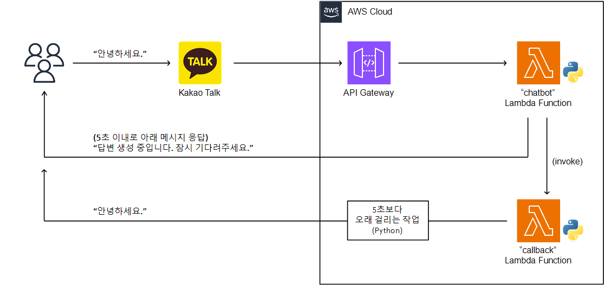

## 1. Serverless Application 배포

AI 챗봇의 소스코드(base.zip) 파일을 [다운로드](https://stem-hackathon-2024.s3.us-west-2.amazonaws.com/base.zip)합니다.

다운로드 받은 base.zip 파일의 압축을 풀고 CMD 또는 터미널을 열어 루트 경로로 이동합니다. (template.yaml 파일이 보이는 위치)

Workshop Studio에서 아래와 같이 "Get AWS CLI credentials"를 눌러 AWS CLI credentials를 확인하고 복사해서 CMD 또는 터미널에 붙여넣고 실행합니다. 
(바로 위에 있는 "Open AWS console"을 눌러 콘솔창도 미리 열어두면 좋아요.)

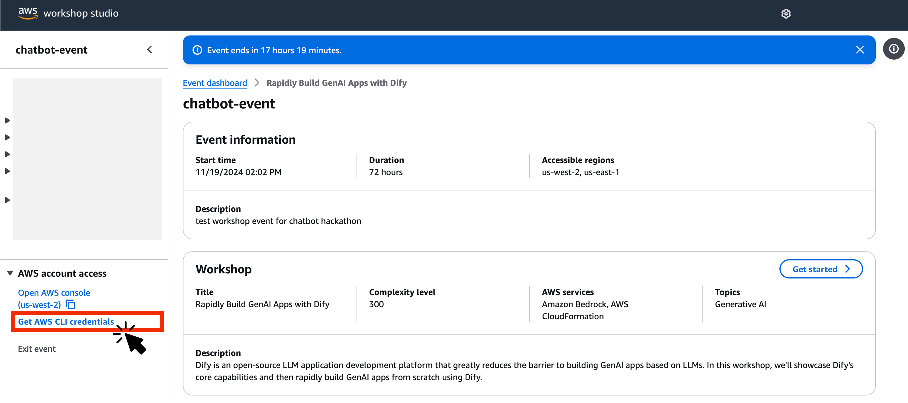

이 과정을 통해 현재 CMD 또는 터미널 환경에서 Workshop AWS 환경에 접속할 수 있는 권한이 설정됩니다. 

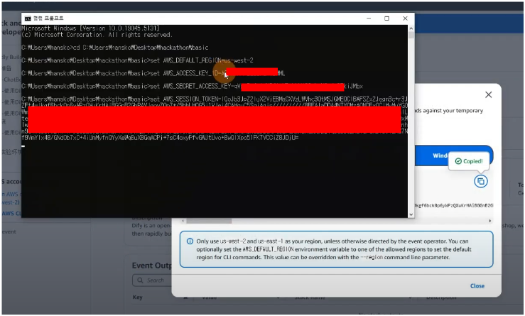

CMD 또는 터미널에서 아래의 명령어를 입력해 다운로드 받은 코드(서버리스 어플리케이션)를 AWS에 배포합니다.

```
sam build
sam deploy --guided --capabilities CAPABILITY_NAMED_IAM
```

```
    Setting default arguments for 'sam deploy'
    =========================================
    Stack Name [sam-app]: ai-chatbot
    AWS Region [us-west-2]:
    #Shows you resources changes to be deployed and require a 'Y' to initiate deploy
    Confirm changes before deploy [y/N]: n
    #SAM needs permission to be able to create roles to connect to the resources in your template
    Allow SAM CLI IAM role creation [Y/n]: y
    #Preserves the state of previously provisioned resources when an operation fails
    Disable rollback [y/N]: n
    KakaoChatbotLambdaFunction has no authentication. Is this okay? [y/N]: y
    Save arguments to configuration file [Y/n]: y
    SAM configuration file [samconfig.toml]:
    SAM configuration environment [default]:
```

이제 콘솔에 접속하고, Lambda에 들어가면 아래 이미지처럼 `chatbot-lambda` 함수와 `callback-lambda` 함수가 생성된 것을 확인할 수 있습니다.


## 2. 챗봇 스킬 추가

[카카오 비즈니스](https://business.kakao.com/)에서 [채널]->[내 챗봇]->[챗봇 관리자센터]로 접속 후, 챗봇의 스킬을 추가합니다.


스킬이 추가되었으면, 이제 챗봇과 AWS에 배포한 서버리스 어플리케이션을 연결해주기 위해 스킬에 아래의 이미지와 같이, `URL`과 헤더값을 추가합니다.
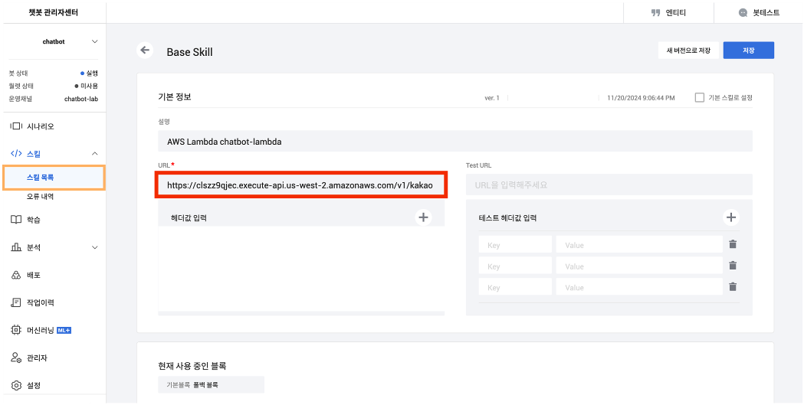

- `URL`: API Gateway의 API Endpoint 
URL에 API Gateway의 Endpoint URL을 추가해주면서, 챗봇이 호출되었을 때 챗봇은 연결된 API를 호출하고 이 API는 Lambda 함수를 작동시키는 구조입니다. 
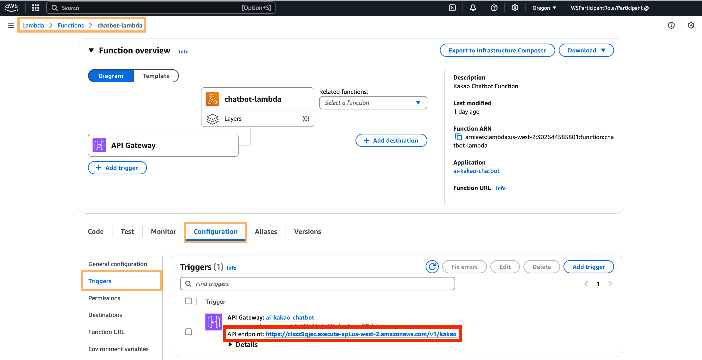

<!--
- `x-api-key`: API Key
API Gateway에서 Lambda 함수에 연결된 API를 선택합니다. Method request의 API key required 값을 `True` 로 설정합니다. 
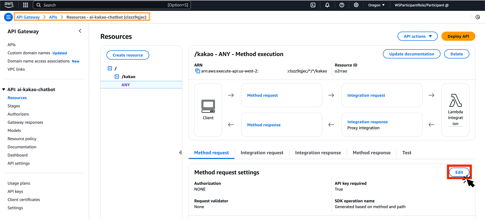
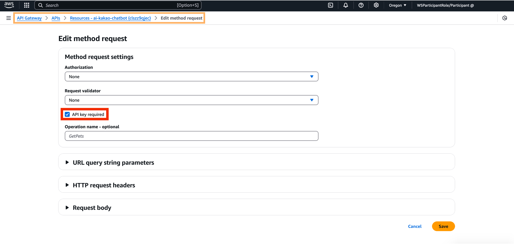
이제 이 API를 호출하려면 반드시 API Key를 가지고 있어야 합니다. 
API Key를 생성하고 그 값을 챗봇의 스킬-헤더값에 추가합니다. 
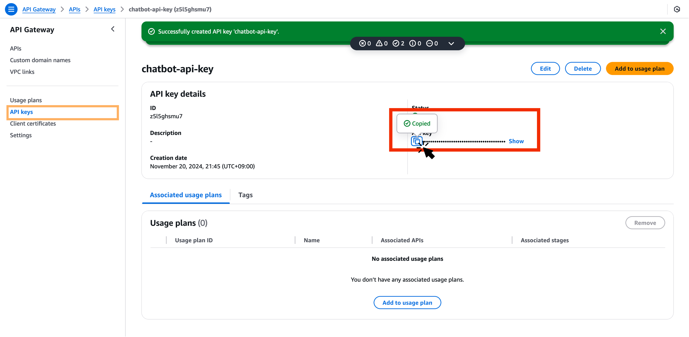

💡 API Key를 찾아내는 방법은 이 [문서](https://docs.aws.amazon.com/ko_kr/apigateway/latest/developerguide/api-gateway-setup-api-key-with-console.html)에서 자세히 확인할 수 있어요!
-->

## 3. 챗봇 시나리오 설정

챗봇 [시나리오](https://kakaobusiness.gitbook.io/main/tool/chatbot/main_notions/scenario)는 챗봇이 사용자에게 어떠한 목적의 서비스를 제공하는지에 대한 일련의 대화흐름입니다. 

[블록](https://kakaobusiness.gitbook.io/main/tool/chatbot/main_notions/block)은 챗봇이 수행하게 될 하나의 작업 단위입니다. 이 때 사용자의 예상 발화, 챗봇이 수행할 액션, 챗봇이 사용자에게 반환하는 응답을 설계합니다.

블록에서 사용할 스킬로, 앞서 생성한 스킬을 선택합니다. 
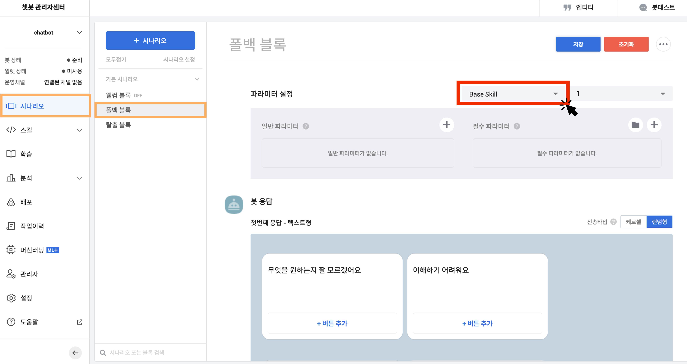


이번 실습의 경우, 스킬에 연결된 Bedrock의 처리시간이 오래 걸리는 경우를 위하여 callback 기능을 사용할 수 있도록 설정합니다. 
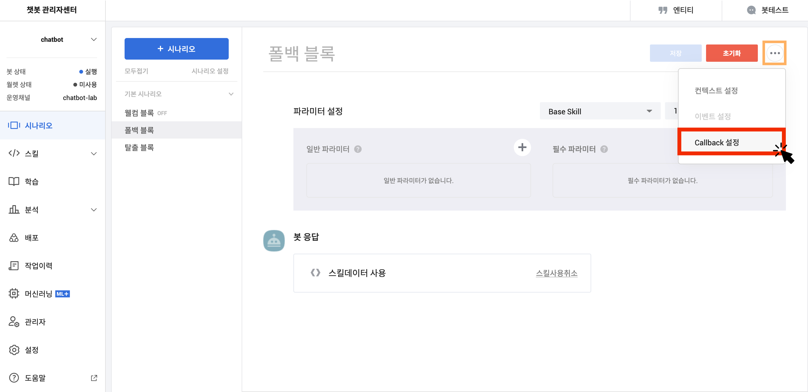

callback 설정을 활성화하고 입력창에 `{{#webhook.text}}`를 입력합니다. `{{#webhook.text}}`는 카카오톡에서 지정한 [응답형식](https://kakaobusiness.gitbook.io/main/tool/chatbot/skill_guide/apply_skill_to_block#use_response_settings_as_values)으로 `{{#webhook.text}}`가 있어야 chatbot-lambda(app.py)가 반환하는 `text` 데이터를 카카오톡 메시지로 받을 수 있습니다. `{{#webhook.text}}` 입력까지 완료했다면 확인을 선택합니다.

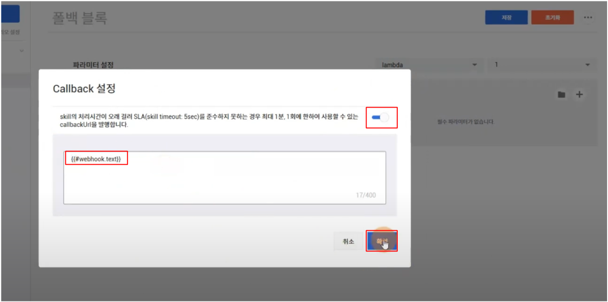

💡 블록에 스킬을 연결하는 방법은 ["블록에 스킬 적용하기"](https://kakaobusiness.gitbook.io/main/tool/chatbot/skill_guide/apply_skill_to_block#use_response_settings_as_values)에서 자세히 확인할 수 있어요!

## 4. 테스트-!

이제 챗봇을 배포합니다!


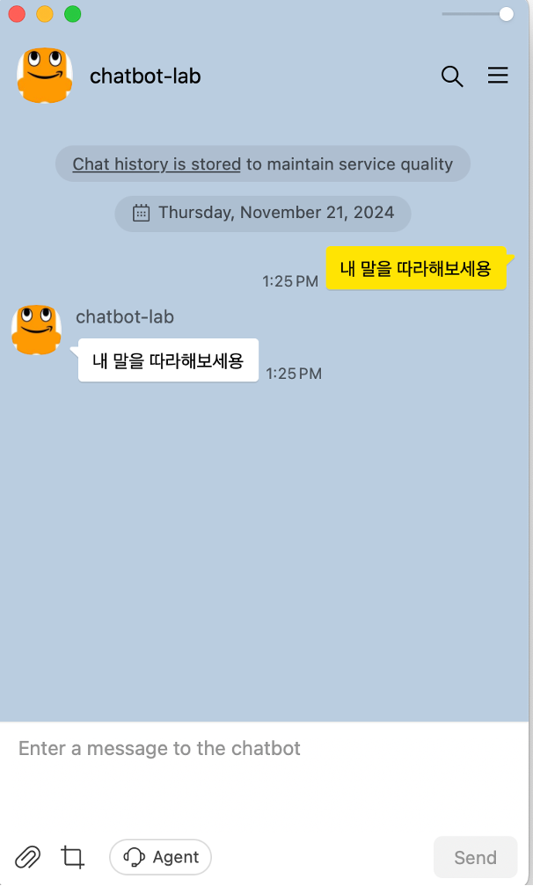