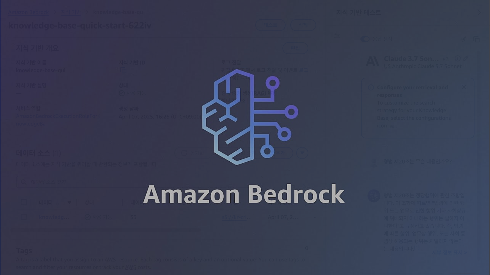

# 실습 소개 👨🏻‍⚖️

---

## 시나리오  
법을 아는만큼 자유로워진다는 말이 있습니다. 본인의 권리를 아는만큼 행동에 있어서 더욱 제약이 사라지기 때문입니다. 그러나, 법이란 너무 어렵고 멀게 느껴지는 경우가 많습니다. 특히 주관적이고 모호한 부분이 많은만큼 이는 더 어렵게만 느껴지는데, 법을 알아야만 하는 순간은 언제나 갑작스럽게 찾아옵니다. 이런 간극을 좁히기 위해, 이번 실습에서는 Amazon Bedrock의 Knowledge Bases를 활용하여 최근 대법원의 판례와 형법에 근거한 법률 상담 시스템을 구축하여 접근성을 높여볼 계획입니다.  

다만, 이렇게 구축한 시스템은 법적 효력은 없으며, 공식적으로는 법적 사항에 대한 자문과 조언은 변호사만 할 수 있습니다. 사실과 다른 답변이 생성되어 그것을 활용하였을 때의 책임 소재 등 AI를 통하여 생성되는 법률적 내용에 대한 적법성 및 신뢰 가능성에 대하여서는 아직도 논란이 있으니 주의 부탁드립니다.  

### 아키텍처  

Bedrock Knowledge Bases with Criminal Law Data 실습에서는 형법 및 정당방위 판례 데이터를 S3 버킷에 업로드한 뒤, 이를 OpenSearch를 활용하여 벡터DB에 적재합니다. 이후, Bedrock Knowledge Bases를 활용하여 해당 데이터를 참고하여 법률 질의응답을 진행합니다. 최종적으로, 판례를 토대로 법의 모호한 부분들을 실제 사례를 토대로 설명해줍니다.

---

## 참고자료

### 실습 가이드 영상

실습 내용을 확인하실 수 있는 가이드 영상입니다. 참고 부탁드립니다.

[**Bedrock Knowledge Bases with Criminal Law**](https://youtu.be/OhdlTUkMivs)  

### 실습 데이터

실습에서 활용될 형법 (범죄와 형벌에 관한 법률 체계) PDF 파일입니다.  
또한, 형법 중 정당방위에 대한 최신 대법원 판례 PDF 파일들입니다.  
링크를 클릭하여 다운로드해주시길 바랍니다.   

#### 형법  
- [**형법 (1장)**](data/형법(법률)(제20795호)(20250318).pdf)  
- **정당방위 판례 (2장)** 
    - [판례#1](<data/cases/판례_2016다26662, 26679, 26686.pdf>) 
    - [판례#2](data/cases/판례_2020도6874.pdf) 
    - [판례#3](data/cases/판례_2020도15812.pdf) 
    - [판례#4](<data/cases/판례_2021고합247, 322.pdf>) 
    - [판례#5](data/cases/판례_2023도10768.pdf)

#### 양형 자료 (3장)
* [요약 2023 연간보고서](data/simplest2023annualreport.pdf)
* [요약 2024 양형기준](data/simplest2024_sentencing_guidelines.pdf)

### 출처
- [국가법령정보센터](https://www.law.go.kr/%EB%B2%95%EB%A0%B9/%ED%98%95%EB%B2%95) - 형법 및 판례
- [양형위원회](https://sc.scourt.go.kr/sc/krsc/board/BoardViewAction.work?gubun=1&currentPage=&searchWord=&searchOption=&seqnum=1618) - 연간보고서 및 양형기준

---

## 기타 서비스

### Amazon S3
Amazon S3(Simple Storage Service)는 데이터를 저장하고 검색할 수 있는 객체 스토리지 서비스입니다. 업계 최고 수준의 확장성, 데이터 가용성, 보안 및 성능을 제공하며, 모든 규모의 고객이 Amazon S3를 데이터 레이크, 웹사이트, 모바일 애플리케이션, 백업 및 복원, 아카이브, 엔터프라이즈 애플리케이션, IoT 디바이스, 빅데이터 분석 등 다양한 용도로 활용할 수 있습니다.

[**Amazon S3 공식 문서**](https://docs.aws.amazon.com/ko_kr/AmazonS3/latest/userguide/Welcome.html)