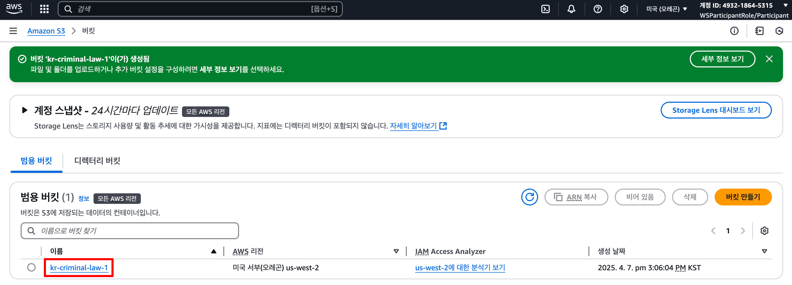
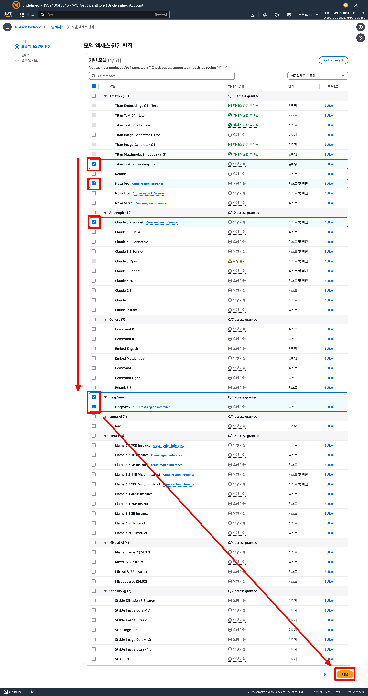
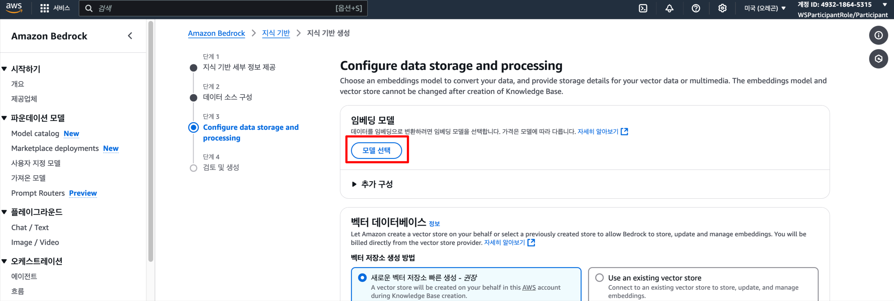

# 실습 가이드 🗃️

---
S3에 데이터셋을 업로드하여 구조화된 데이터 검색을 위한 기반을 만들어봅시다.   
이 데이터셋은 법률 관련 분석에 활용될 중요한 정보를 담고 있습니다.

⚠️ 모든 실습은 us-west-2 (오레곤) 지역에서 진행합니다.

---

### 사전준비: 접속하기

**a. 제공된 링크에 접속하여 권한을 확인합니다.**  

**b. AWS console에 접속합니다.**  

## 1장. 형법 시스템 구축하기

### Step 1: S3에 데이터 업로드  

**a. S3 버킷을 생성합니다.**   

[AWS 콘솔](https://us-west-2.console.aws.amazon.com/console/home?region=us-west-2) 좌측 상단에 S3를 검색하여 클릭하거나 [S3 콘솔](https://us-west-2.console.aws.amazon.com/s3/home?region=us-west-2#)에 직접 접속합니다.

이때 주의해야 할 점으로는 S3 버킷은 **고유 이름이 필요**하기 때문에 같은 이름을 사용하실 경우 생성이 안 될 수도 있습니다. 따라서, 생성이 안 된다면 이름을 다르게 해보시는 걸 추천해 드립니다.  

- 버킷 생성을 위해 `버킷 만들기`를 클릭합니다.  

  

- 버킷명을 작성한 뒤, `버킷 만들기`를 클릭합니다.   
(*예시에서는 `kr-criminal-law-1`라고 작성했으나, 중복된 이름으로 생성이 불가능하기 때문에 생성이 안되는 경우에는 중복을 예방하기 위해 `kr-criminal-law-2` 등으로 시도해주시면 됩니다.*)  

  

- 정상적으로 생성된 것을 확인하실 수 있습니다.

    

**b. 제공받은 형법 PDF 파일을 업로드합니다.**

- 생성하신 버킷을 클릭합니다.  

- `형법(법률)(제20795호)(20250318).pdf` 파일을 업로드합니다.  

- 무사히 `형법(법률)(제20795호)(20250318).pdf`가 업로드 된 것을 확인합니다.  

- 위 과정을 똑같이 `credit` 폴더에 들어가서 `credit.csv` 업로드합니다.   

### Step 2: Foundation Models 권한 신청  

a. **Bedrock 콘솔에 접속합니다.**  

[AWS 콘솔](https://us-west-2.console.aws.amazon.com/console/home?region=us-west-2) 좌측 상단에 Bedrock를 검색하여 클릭하거나 [Bedrock 콘솔](https://us-west-2.console.aws.amazon.com/bedrock/home?region=us-west-2#/)에 직접 접속합니다.  

   

- `Amazon Bedrock` 콘솔로 접속한 뒤, 사이드바에 있는 `Bedrock Configurations`에 위치한 `모델 엑세스`에 접속합니다.  

   

- `모델 엑세스 권한 수정`을 클릭합니다.  

  

- 이번 실습에서 활용될 `Titan Text Embeddings V2`와 `Claude 3.7 Sonnet`을 선택합니다.  
(*이외에 선택하고 싶으신 모델들을 자유롭게 모두 신청하셔도 됩니다. 개인적으로는 Amazon의 Nova Pro와 최근에 화제가 되었던 DeepSeek-R1을 추천드립니다.*)  

  

- `제출`을 클릭합니다.  

   

### Step 3: Knowledge Base 생성하기    
[AWS 콘솔](https://us-west-2.console.aws.amazon.com/console/home?region=us-west-2) 좌측 상단에 Bedrock를 검색하여 클릭하거나 [Bedrock Knowledge Base 콘솔](https://us-west-2.console.aws.amazon.com/bedrock/home?region=us-west-2#/knowledge-bases)에 직접 접속합니다.  

**a. Structured Knowledge Base를 생성합니다.**  

- `생성`을 클릭한 뒤, `벡터 저장소가 포함된 지식 기반`을 클릭합니다.  

**단계 1: 기타 설정 없이 다음으로 넘어갑니다.**   

- `단계 1`에서는 변경해야 할 사항이 없는 관계로, `다음`을 클릭합니다.  

  

**단계 2: `단계 2: 데이터 소스 구성`에서는 본인이 생성한 S3 버킷을 데이터 소스로 지정합니다.**  

- `Browse S3`를 선택합니다.

  

- 이전에 생성한 S3 버킷을 선택합니다.  
  

- `다음`을 클릭합니다.  
  

**단계 3: `단계 3`에서는 본인의 데이터를 임베딩할 모델을 선택합니다.**  

- `임베딩 모델`을 선택합니다.  
  

- `Titan Text Embeddings V2`를 선택하고 적용합니다.
   

- `다음`을 선택하여 다음 단계로 갑니다.  

**b. Knowledge Base를 생성합니다.**  

- `지식 기반 생성` 을 클릭합니다.  
    

- Amazon Opensearch Serverless에서 벡터 데이터베이스를 준비하는 중입니다. 이 프로세스를 완료하는 데 몇 분 정도 걸릴 수 있기 때문에 잠시 기다려줍니다.  
    

### Step 4: 데이터 동기화 및 테스트 해보기   

**a. 데이터 소스를 동기화합니다.**  

  

**b. 동기화가 끝나면, 사용하실 모델을 선택합니다.**  

- `모델 선택`을 클릭합니다.  
  

- `Claude 3.7 Sonnet`을 선택한 후, 적용을 클릭합니다.  
  

- 테스트를 진행합니다. 몇가지 예시 질문으로는 다음이 있습니다:
  - *무슨 데이터를 갖고 있나요?*  
  - *형법 제20조는 무슨 내용인가요?*  

  

## 2장. 판례 데이터 추가하기

### Step 1: S3에 판례 데이터 업로드 

이전과 같게 [AWS 콘솔](https://us-west-2.console.aws.amazon.com/console/home?region=us-west-2) 좌측 상단에 S3를 검색하여 클릭하거나 [S3 콘솔](https://us-west-2.console.aws.amazon.com/s3/home?region=us-west-2#)에 직접 접속합니다.

**a. 이전에 생성했던 S3 버킷에 들어갑니다.**   

  

**b. 폴더를 생성하여, 판례 데이터를 업로드합니다.**  

- `폴더 만들기`를 클릭합니다.  
  

- 폴더명을 추가하고 `cases`, `폴더 만들기`를 클릭합니다.  

- 생성한 `cases` 폴더를 클릭합니다.    
  

- 다운로드 받은 5개의 판례를 업로드합니다.  

- `업로드` 버튼을 클릭합니다.  

### Step 2: Knowledge Base 동기화   

S3에 새로운 데이터를 올린만큼, 데이터를 동기화해야 합니다. 이를 하기 위해 Amazon Bedrock Knowledge Base 콘솔로 돌아갑니다. [AWS 콘솔](https://us-west-2.console.aws.amazon.com/console/home?region=us-west-2) 좌측 상단에 Bedrock를 검색하여 클릭하거나 [Bedrock Knowledge Base 콘솔](https://us-west-2.console.aws.amazon.com/bedrock/home?region=us-west-2#/knowledge-bases)에 직접 접속합니다.   

**a. Knowledge Base에서 동기화를 다시 진행합니다.**   

- 이전에 Knowledge Base (지식 기반)에 들어갑니다.  

- `데이터 소스`를 선택하고, `동기화`를 클릭합니다.  
  

**b. 판례 데이터에 대하여 실험해봅니다.**  

- 모델을 선택합니다.  
  
  

- 판례를 기반으로 한 질의응답을 실헙해봅니다.  

- 축하드립니다. 이에 대하여 판례가 정상적으로 조회되고 있는 것까지 확인할 수 있습니다. 🥳  
  

## 3장. 표와 그림 데이터 최적화  

형법과 관련된 판례를 비교해서 확인하는 방법을 탐구해봤습니다. 이어서 벌금표와 실제 범죄에 대하여 형량과 금전적 보상을 확인해볼 차례입니다.  

예시로, 다음 `2024 양형기준`에 제공되는 형종 및 형량의 기준 표를 살펴보겠습니다. 이를 살펴보면, 일반강도와 특수강도에 대해서 형량의 길이를 확인 할 수 있습니다.

  

해당 문서를 S3에 올리고 동기화를 진행한 뒤 실험을 해본 결과는 다음과 같습니다. 기본 파서를 사용해도, 표 정보가 일정 수준으로 파악이 잘 되는 것을 볼 수 있습니다.   

  

그러나, 더 복잡한 그림이나 표를 맞이하게 되면 자동 파서로는 부족한 경우가 종종 발생합니다. 예시로, 양형의 주요 지표들을 담고 있는 양형의원회의 2023 연간보고서를 살펴보면 다음과 같은 표를 볼 수 있습니다. 이때, Knowledge Base는 답을 제대로 못하고 있는 것을 확인 할 수 있습니다.  

이런 경우에 대해서 좋은 성능을 보이고 싶다면 다음 방법을 한번 사용해 볼 수 있습니다.  

### Step 1: 시간 단축을 위한 S3 데이터 변경

기본 파서와는 다르게 이번에 활용할 방법은 시간이 더 오래 걸리는 관계로 더 이상 사용하지 않을 형법과 판례 데이터를 삭제하고, 새로 사용할 데이터를 S3에 올려보도록 하겠습니다.  

**a. 기존의 데이터를 모두 삭제합니다.**  

- 우선 삭제를 하기 위해 본인이 이전에 생성했던 S3 버킷으로 돌아갑니다.  
 

- 이후, 모든 객체를 다음과 같이 선택한 뒤, `삭제`를 클릭합니다.  

- `영구 삭제`를 기입하신 뒤, `객체 삭제`를 클릭합니다.

**b. 새로 사용 될 데이터를 업로드합니다.**  

- `업로드`를 클릭합니다.  

- 실습을 위해 준비된 [`2023 연간보고서`](data/simplest2023annualreport.pdf)와 [`2024 양형기준`](data/simplest2024_sentencing_guidelines.pdf) pdf들을 올려주시길 바랍니다.  

### Step 2: Knowledge Base 생성하기  
이전과 똑같이 Knowledge Base를 생성하되, 구문 분석 전략을 다르게 설정하면 됩니다.  

  

**단계 1: 기타 설정 없이 다음으로 넘어갑니다.**   

- `단계 1`에서는 변경해야 할 사항이 없는 관계로, `다음`을 클릭합니다.  

  

**단계 2: 이전과 똑같이 `단계 2: 데이터 소스 구성`에서는 본인이 생성한 S3 버킷을 데이터 소스로 지정합니다.**  

- `Browse S3`를 선택합니다.  

  

- 이전에 생성한 S3 버킷을 선택합니다.  
  

### Step 3:❗️ [핵심] 구문 분석 전략  
데이터 소스 중, **`구문 분석 전략`** 부분에서 `파서로서의 파운데이션 모델`을 선택하고 `Claude 3.5 Sonnet v1`을 선택합니다.  

이때, `구문 분석을 위한 지침`을 확인해보시면 다음과 같은 지침을 볼 수 있습니다. 특히, 이미지의 경우에 대해서는 이에 대한 설명을 글로 바꾸도록 하고 표의 경우에는 성능 개선을 위해 마크다운 형식으로 바꿔주도록 설계되어 있습니다.    

- `청킹 전략`을 기본 청킹이 아닌 `계층적 청킹`으로 설정합니다.

- `다음`을 클릭합니다.  

**단계 3: `단계 3`에서는 본인의 데이터를 임베딩할 모델을 선택합니다.**  

이전과 동일하게 `임베딩 모델`을 선택합니다.  

  

- `Titan Text Embeddings V2`를 선택하고 적용합니다.
   

- `다음`을 선택하여 다음 단계로 갑니다.  

**b. Knowledge Base를 생성합니다.**  

- `지식 기반 생성` 을 클릭합니다.  
    

- Amazon Opensearch Serverless에서 벡터 데이터베이스를 준비하는 중입니다. 이 프로세스를 완료하는 데 몇 분 정도 걸릴 수 있기 때문에 잠시 기다려줍니다.  
   

### Step 4: 데이터 동기화 및 테스트 해보기   

**a. 데이터 소스를 동기화합니다.**  

  

**b. 동기화가 끝나면, 사용하실 모델을 선택합니다.**  

- `모델 선택`을 클릭합니다.  
  

- `Claude 3.7 Sonnet`을 선택한 후, 적용을 클릭합니다.  
  

- 테스트를 진행합니다. 몇가지 예시 질문으로는 다음이 있습니다:
  - *양형위원회의 조직도 구성이 어떻게 되어 있나요?*  

**A. `기본 청킹`으로 설정되어 있는 경우 다음과 같이 그림 또는 표는 이해 못하는 경우가 있습니다.**

**B. 반대로, `계층적 청킹`과 `파서로서의 파운데이션 모델`으로 설정된 Knowledge Base는 다음과 같이 정확하게 이를 파악하고 있는 것을 확인 할 수 있습니다.**

  

  

  

**축하합니다!** 🥳 🎉 

여러분은 이제 Amazon Bedrock의 Knowledge Bases를 활용하여 개인 맞춤화되어 있는 시스템을 구축할 수 있으며, 이를 토대로 법률 자문 뿐만 아니라 다양한 문서로부터 정확한 정보를 편하고 정확하게 받을 수 있습니다. 

실습 따라오시느라 수고 많으셨습니다.  