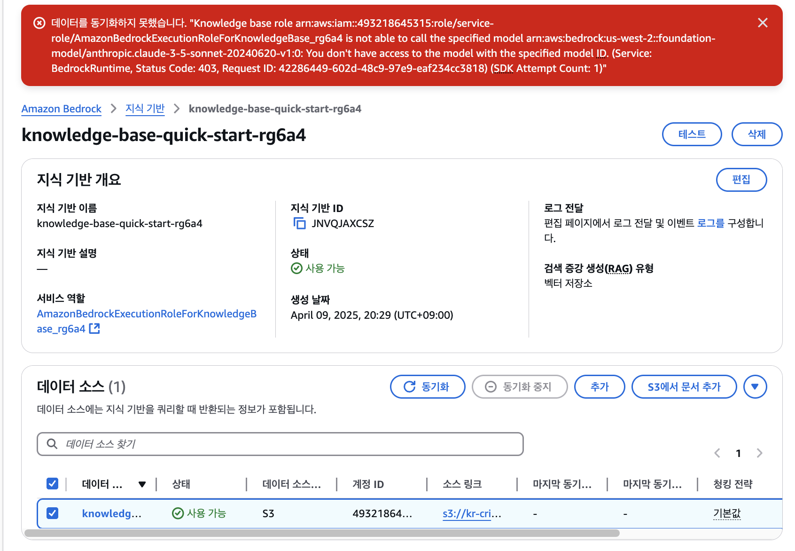
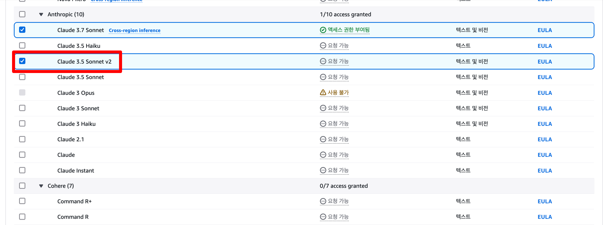
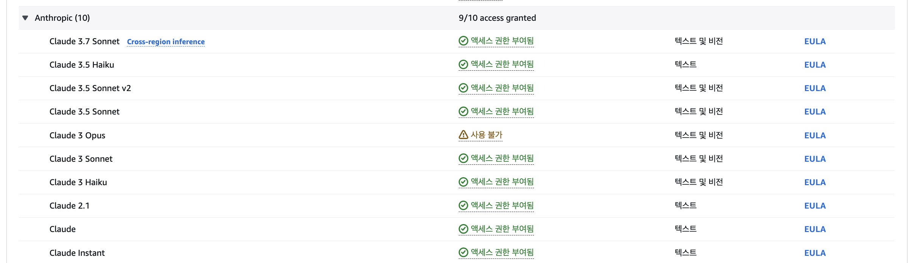

# QnA 

---

## 생성 권한 문제: AccessDeniedException  

다음과 같이 `AccessDeniedException`이 발생할 경우, IAM Permissions에서 권한이 막혀있는 경우입니다. 참가자는 IAM 권한 수정이 불가하기에 다음과 같은 방안을 시도해볼 수 있습니다:

1. 리전 오류: 실습환경에서 준비하고 허가해드린 확경들은 `us-east-1`과 `us-west-2`인만큼, `ap-northeast-2 (서울)` 등의 리전으로 설정되어 있으면 권한이 막혀 있을 수 있습니다.  
2. 리전이 `us-east-1` 또는 `us-west-2`임에도 불구하고 접근이 안 되면 예비 계정으로 새로 시도해보시는것을 권장드립니다.


## 동기화 실패 오류: 데이터를 동기화하지 못했습니다. 

해당 오류는 다양한 원인으로 발생할 수 있지만, 권한 문제일 가능성이 매우 높습니다. 이 때문에, 다음 순서로 하나씩 디버깅을 시도해보시는걸 추천드립니다.


### 모델 권한 오류

```
데이터를 동기화하지 못했습니다. "Knowledge base role arn:aws:iam::493218645315:role/service-role/AmazonBedrockExecutionRoleForKnowledgeBase_rg6a4 is not able to call the specified model arn:aws:bedrock:us-west-2::foundation-model/anthropic.claude-3-5-sonnet-20240620-v1:0: You don't have access to the model with the specified model ID. (Service: BedrockRuntime, Status Code: 403, Request ID: 42286449-602d-48c9-97e9-eaf234cc3818) (SDK Attempt Count: 1)"
```

 


이런 경우, 모델 권한이 부여가 안된 경우입니다. 즉, 모델 액세스로 가셔서 다음과 같이 신청하시면 됩니다. 

 


저는 만일을 대비하여 모든 Anthropic 모델 권한을 신청했습니다.




### 기타  
흔히 발생할 수 있는 문제들은 위 작업들을 수행하거나 지웠다 다시 생성하면 보통 해결되긴 하지만, 이외에도 다양한 문제들이 발생할 수 있습니다. 그럴 때마다 당황하지 마시고 도움을 요청하시면 바로 찾아가서 도와드리도록 하겠습니다.  