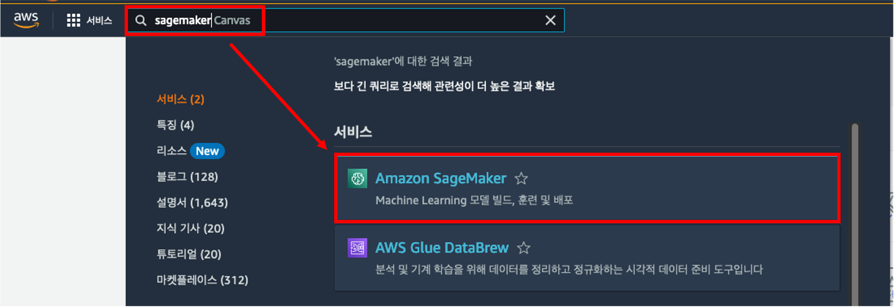
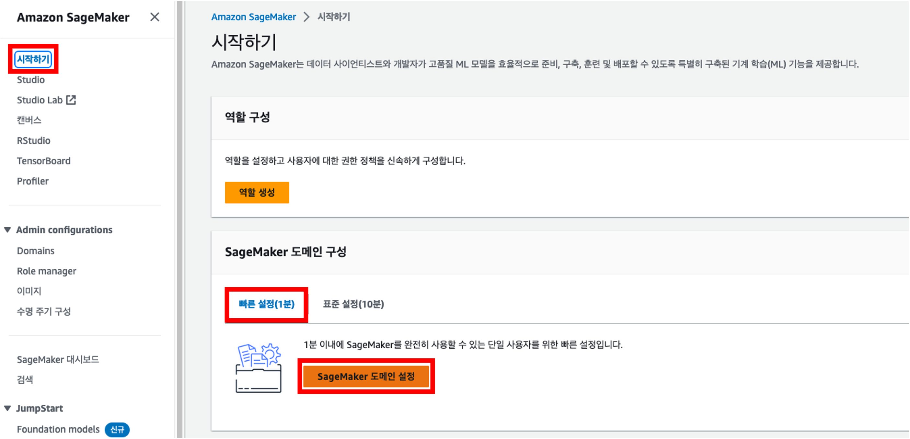
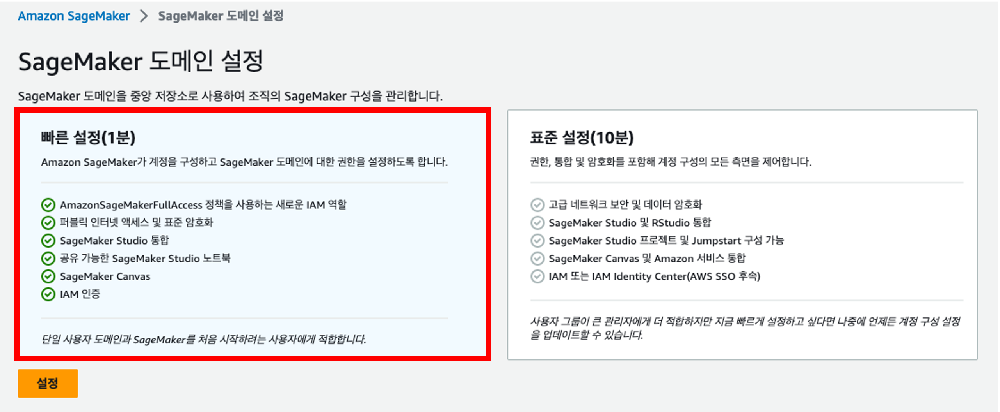
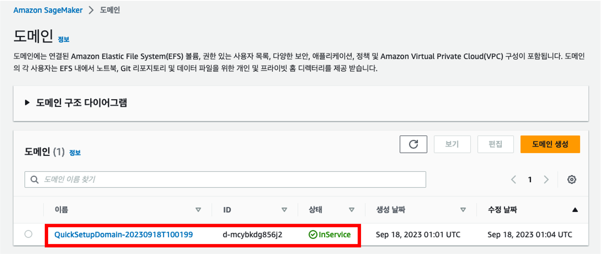
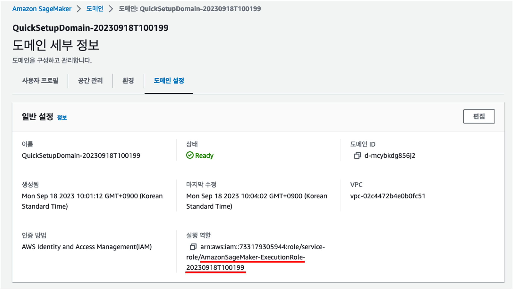
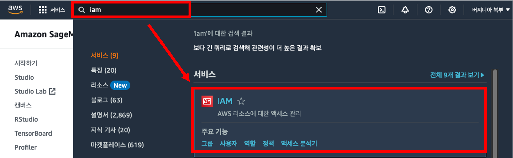
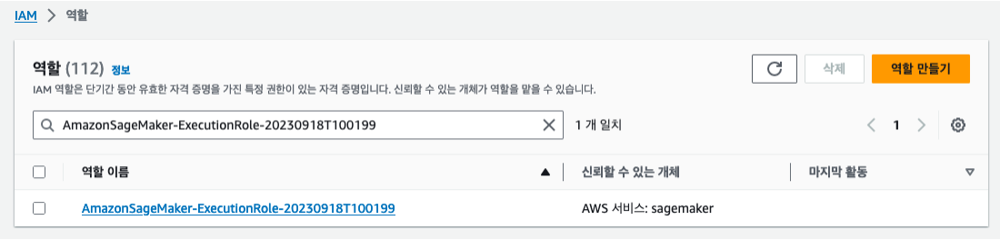
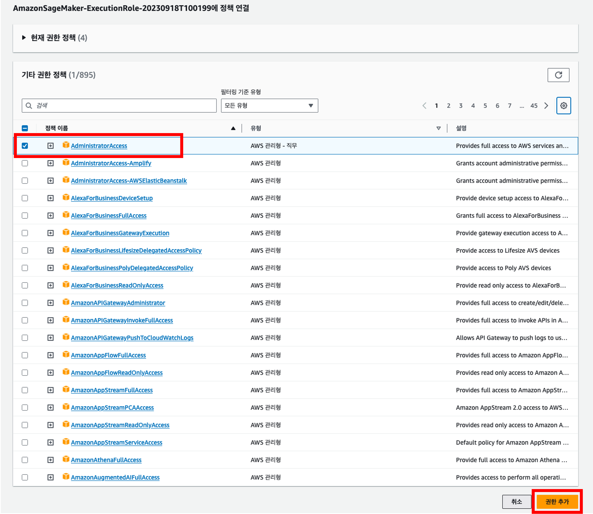

# SageMaker

## SageMaker 에 대하여

 

Amazon SageMaker는 완전관리형 기계학습(Machine Learning;ML) 서비스입니다. 데이터 사이언티스트와 개발자는 SageMaker를 이용해 기계학습 모델을 빠르고 쉽게 빌드하고 훈련시킬 수 있고, 프로덕션 지원 호스팅 환경에 직접 배포할 수 있습니다. 

# SageMaker 실습 환경 세팅 🛠️

> 리전은 us-east-1(버지니아북부)로 설정합니다.

## SageMaker 도메인 구성

SageMaker의 여러 기능을 사용하기에 앞서, 도메인을 가장 먼저 생성해야 합니다. 

SageMaker 도메인은 SageMaker의 기계 학습 환경으로, Amazon Elastic File System (Amazon EFS), 권한을 가진 사용자 목록, 여러 보안 설정 및 정책, 네트워크(VPC) 설정으로 구성되어 있습니다. 

이러한 설정을 기반으로 SageMaker Studio(Notebook), Canvas 등을 사용하게 됩니다.

1. AWS 콘솔에서 **SageMaker**를 검색합니다.

2. SageMaker 도메인을 생성하기 위해 왼쪽 메뉴 탭에서 "**시작하기(Getting Started)**"를 클릭합니다. 그리고 [SageMaker] > [빠른 설정] > "SageMaker 도메인 설정"을 클릭합니다. 

> 도메인과 사용자가 자동으로 생성되고 구성되기까지 약 5~10분의 시간이 소요됩니다.

3. 도메인 구성이 완료되면 상태가 "InService"로 바뀐 것을 확인할 수 있습니다.

## SageMaker IAM Role(역할) 권한 수정

1. 도메인을 구성하며 자동으로 생성된 SageMaker를 위한 IAM Role에 Administrator 권한을 추가해보겠습니다. 생성된 도메인을 클릭하고, [도메인 설정] 탭을 클릭합니다. [일반 설정] 정보 중 [실행 역할]의 값을 복사합니다.

2. 이제 IAM에서 해당 실행 역할(role)을 검색합니다.

3. SageMaker 도메인에 연결된 실행 역할을 클릭하고, `Administrator` 권한을 추가합니다.

이제 SageMaker를 사용할 준비가 완료되었습니다!