# AI를 이용한 그림 그리기

## AI를 이용한 그림 그리기 🎨

이번 실습에서 사용되는 함수는 이미지와 프롬프트 텍스트 두 가지의 입력을 사용하여 작동합니다. 멀티 모달(Multi-Modality) 모델의 기능을 활용하고 있습니다.

실습에서는 Stable Diffusion 모델을 사용했으며, 프롬프트(텍스트)는 영어로 작성되었습니다. 이 때 Amazon Translate를 사용하여 우리가 입력한 텍스트를 영어로 기계 번역한 뒤, 모델에 입력합니다. 즉, 한글로 텍스트를 입력하면 Amazon Translate에 의해 영어로 번역된 후 Stable Diffusion 모델에 입력되는 것입니다.

- **멀티 모달 모델**: '멀티 모달(Multi Modality)'은 시각, 청각 등의 여러 인터페이스를 통해 정보를 주고받는 것을 의미합니다. 이렇게 다양한 정보를 동시에 받아들이고 학습하고 사고하는 AI 모델을 '멀티 모달 AI 모델'이라고 합니다. 멀티 모달 모델을 이용하여 사람과 유사하게 사물을 다양한 방식으로 받아들이고 학습할 수 있습니다.

- **Stable Diffusion model**: Diffusion model(디퓨전 모델) 중 하나로, text-to-image 즉, 텍스트로부터 이미지를 추출하는 모델입니다. 
  - **Diffusion model**(확산 모델): 생성형 모델로, 학습받은 것과 비슷한 새로운 데이터를 생성하도록 설계된 모델입니다.
- **ControlNet model**: Stabel Diffusion을 제어하기 위한 신경망(nueral) 모델로, 단독으로 사용하는 것이 아니라 다른 Stable Diffusion 모델과 함께 사용됩니다.
- **PNDM(pseudo numerical methods for diffusion model) Scheduler**: Stable Diffusion model에 의해 생성된 랜덤한 노이즈 이미지를 깔끔한 이미지로 재생성하기까지에 반복되는 처리의 주요 요소(노이즈의 세기, 종류 등)를 결정합니다.

- [Amazon Translate](https://aws.amazon.com/ko/translate/?nc1=h_ls): AWS에서 제공하는 신경망 기계 번역 서비스(nueral machine translation service)입니다.
- [Hugging Face](https://huggingface.co/): 기계 학습에 필요한 애플리케이션을 빌드할 때 필요한 도구를 개발하는 회사입니다. 자연어 처리 애플리케이션을 위한 트랜스포머 라이브러리와 기계 학습 모델과 데이터셋을 공유하는 플랫폼으로 유명합니다.

## SageMaker Studio 세팅

SageMaker Studio는 JupyterLab App을 실행할 수 있는 기계학습 컴퓨팅 인스턴스를 제공하며, SageMaker Studio에서 JupyterLab 공간을 새로 생성하고 이 위에 여러 함수를 실행할 것입니다. SageMaker JupyterLab에 대하여 더 자세히 알아보고 싶다면 [이 문서](https://docs.aws.amazon.com/ko_kr/sagemaker/latest/dg/studio-updated-jl.html)를 참고하세요.

1. SageMaker에서 본인이 생성한 도메인을 선택합니다.

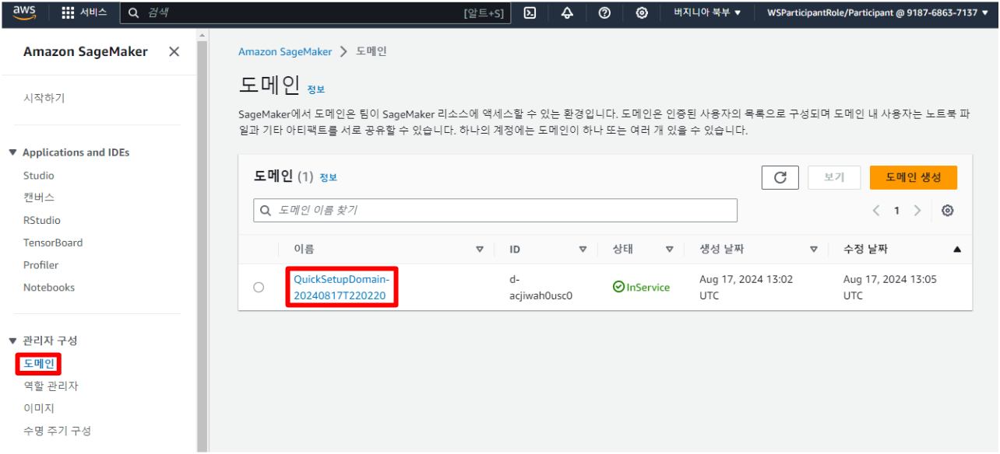

2. **사용자 프로필** 탭에서 **시작** > **Studio**를 선택하여 SageMaker Studio에 접속합니다.
> SageMaker Studio의 앱 구성을 처음 하게 되면 약 3분 정도의 시간이 소요됩니다.
> "Want to take a quick tour?" 문구가 출력된다면 **Skip Tour for now**를 선택합니다.

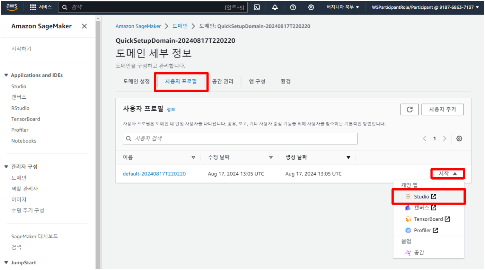

3. Studio에서 **JupyterLab** > **Create JupyterLab space**을 선택합니다.
4. Name을 jupyter로 입력하고 **Create Space**를 선택합니다.

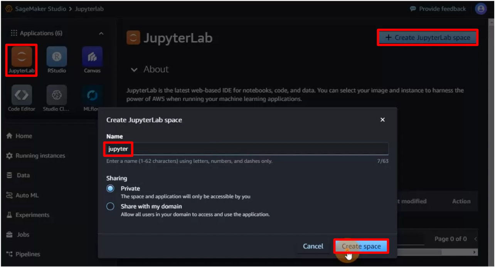

5. Instance는 **ml.g4dn.xlarge**로 설정합니다.
6. Image는 **SageMaker Distribution 1.9**로 설정합니다. 
7. (선택) Storage는 **20**으로 설정합니다.

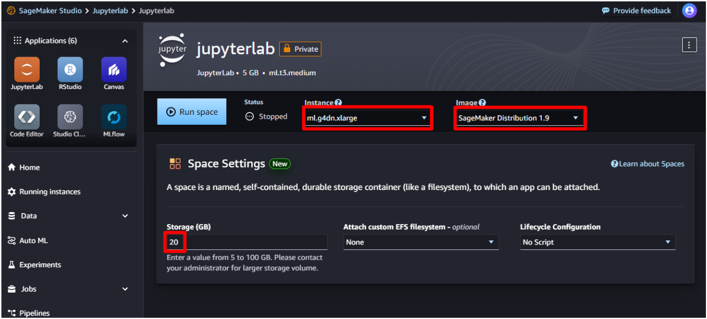

8. 설정을 마치고 **Run Space**를 선택합니다. 


9. Status가 Running으로 바뀌면, **Open JupyterLab**을 선택합니다.
10. JupyterLab이 시작되기까지 기다립니다.

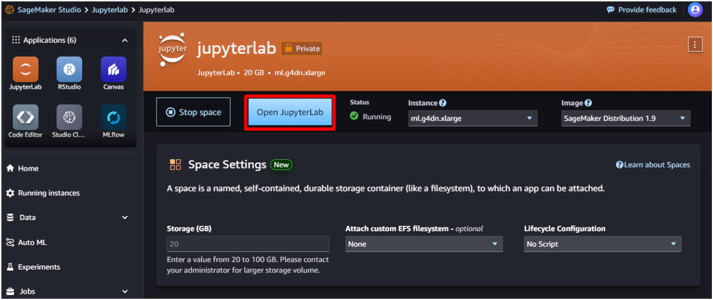

11. Launcher 탭에서 **Python 3 (ipykernel)**을 선택합니다.

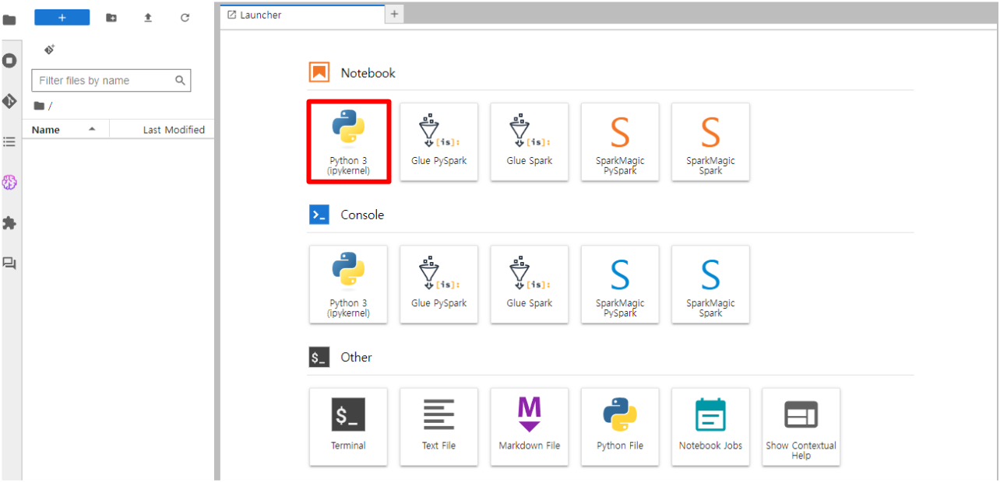

## Text-to-Image: 환경 세팅

1. 환경 변수 설정

```python
import os
os.environ['HF_DATASETS_CACHE'] = "/home/sagemaker-user/.cache"
os.environ['HF_HOME'] = "/home/sagemaker-user/.cache"
```

> Notebook의 각 셀(block)을 실행하기 위해서는 화면 상단의 `▶️` 버튼을 누르거나, [Shift] + [Enter] 키를 누르면 됩니다.

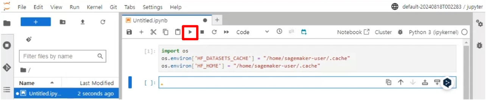


2. 필요한 라이브러리 설치

```sh
!sudo apt-get update && sudo apt-get install ffmpeg libsm6 libxext6 -y -qq
```

3. AIsketcher, HuggingFace Accelerate, opencv 라이브러리 설치

```sh
!pip install --upgrade pip
```
```sh
!pip install AIsketcher git+https://github.com/huggingface/accelerate.git opencv-python
```

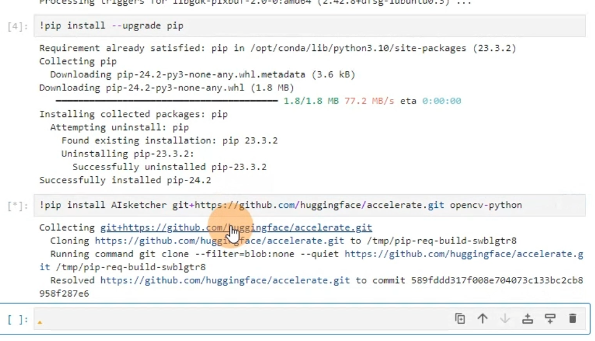

4. 이미 학습이 되어있는 모델, 파이프라인 로드 및 세팅 

(경고 및 에러 문구는 무시하세요)

```python
import os
from diffusers import StableDiffusionControlNetPipeline, ControlNetModel, AutoencoderKL
from diffusers.utils import load_image
from diffusers import DDIMScheduler, DPMSolverMultistepScheduler, HeunDiscreteScheduler, DDPMScheduler, EulerDiscreteScheduler, KDPM2DiscreteScheduler, EulerAncestralDiscreteScheduler, DEISMultistepScheduler, KDPM2AncestralDiscreteScheduler, UniPCMultistepScheduler, LMSDiscreteScheduler, PNDMScheduler, DPMSolverSinglestepScheduler
import cv2
from PIL import Image
import numpy as np
from diffusers import DDPMScheduler
import torch
import random, sys
import boto3
import AIsketcher

trans_info = {
            'region_name' : 'us-east-1', #user region            
            'SourceLanguageCode' : 'ko',
            'TargetLanguageCode' : 'en',
            'iam_access' : True
        }

controlnet_model = "lllyasviel/sd-controlnet-canny"
sd_model = "Lykon/DreamShaper"

controlnet = ControlNetModel.from_pretrained(
    controlnet_model,
    torch_dtype=torch.float16
)

pipe = StableDiffusionControlNetPipeline.from_pretrained(
    sd_model,
    controlnet=controlnet,
    torch_dtype=torch.float16
)

pipe.scheduler = PNDMScheduler.from_config(pipe.scheduler.config)
pipe.enable_model_cpu_offload()
```

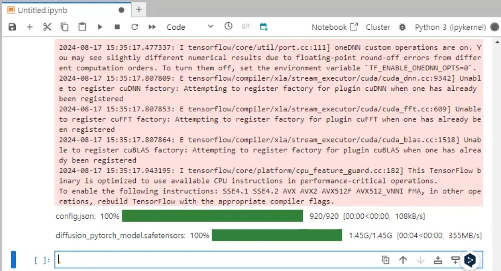

Stable Diffusion model과 ControlNet model을 로드하여 StableDiffusionControlNet pipeline을 구성했고, PNDMScheduler를 준비했습니다!

## Text-to-Image: 이미지 재생성하기

기본 코드는 아래와 같습니다.
```python
file_name = '##ImageFile##'
input_text = input("원하는 그림체를 한국어로 입력하세요: ")
num_steps = 40
guidance_scale = 7
seed =6764547109648557242 # #6854547109648557242 #6764547109648557242 #6634547109688557242
low = 140
high = 160
image, canny_image, out_image = AIsketcher.img2img(file_name,  input_text,  num_steps, guidance_scale, seed, low, high, pipe, trans_info)
out_image.save("result_"+file_name)
Image.fromarray(np.concatenate([image.resize(out_image.size), out_image], axis=1))
```

- file_name: 이미지 파일의 이름을 지정합니다. 
- num_steps: AI가 기존 이미지에서 얼마나 더 그릴 것인지에 대한 정도를 `30`~`250` 사이의 숫자 값으로 지정합니다.
- guidance_scale: AI가 스스로 얼마나 창의적으로 그릴 것인지에 대한 정도를 `0`~`30` 사이의 숫자 값으로 지정합니다.
- seed: AI가 그림을 그리는 시작점으로, 이 값을 변경하면 화풍이 크게 달라집니다.

1. 원하는 이미지를 SageMaker Studio에 업로드합니다.

- 예시 이미지: 마우스 오른쪽 클릭 > Save as... > "present_image1.jpeg"으로 저장


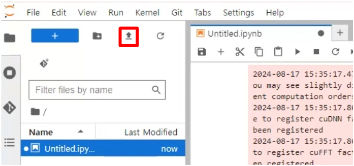
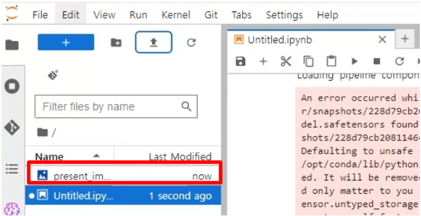

2. `file_name`의 값으로 업로드한 이미지 이름을 지정합니다.

```python
file_name = 'present_image1.jpeg'
input_text = input("원하는 그림체를 한국어로 입력하세요: ")
num_steps = 40
guidance_scale = 7
seed = 6764547109648557242 # #6854547109648557242 #6764547109648557242 #6634547109688557242
low = 140
high = 160
image, canny_image, out_image = AIsketcher.img2img(file_name,  input_text,  num_steps, guidance_scale, seed, low, high, pipe, trans_info)
out_image.save("result_"+file_name)
Image.fromarray(np.concatenate([image.resize(out_image.size), out_image], axis=1))
```

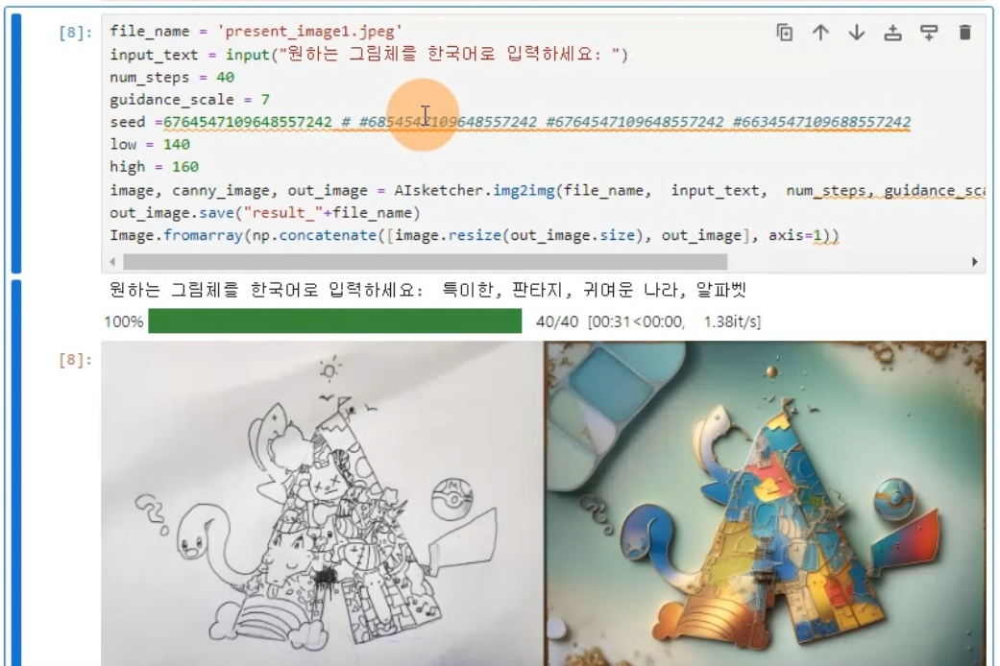

원하는 그림체는 자유롭게 입력하면 됩니다.

3. 이제 그림을 직접 그리거나 다운로드 받아 이미지를 새롭게 생성해봅시다.

## Text-to-Image: 추가 과제
- **상황**: 고객이 회사의 볼펜에 대한 광고 이미지를 의뢰했습니다. 이 볼펜은 내구성과 사용감이 뛰어나지만, 디자인 측면에서는 많이 부족하다는 고객의 피드백이 있습니다. 미팅 중, 볼펜 회사의 엔지니어 고객은 몇몇 추상적인,'멋진', '새로운' 같은 단어들만을 남기고 회의를 끝냈습니다.
- **미션**: 고객이 언급한 추상적인 단어들을 기반으로 신규 볼펜 이미지를 디자인해야 합니다. 이 디자인은 볼펜의 내구성과 사용감의 우수함을 강조하면서도, 새로운 미적 감각을 더해야 합니다.
- **조건**: 디자인은 "멋진", "새로운" 이라는 키워드를 중심으로 해야 합니다. 볼펜의 내구성과 사용감을 시각적으로 잘 표현해야 합니다. 고객이 언급한 추상적인 단어들을 최대한 활용하여 디자인에 창의적인 요소를 더해야 합니다.

볼펜 이미지는 직접 검색을 통해 다운로드받고, 원하는 그림체를 위에 언급된 조건에 맞게 입력하여 볼펜 광고 이미지를 만들어봅시다.

```python
file_name = '##볼펜이미지##'
input_text = input("원하는 그림체를 한국어로 입력하세요: ")

num_steps = 40
guidance_scale = 7
seed = 6854547109648557242 #6764547109648557242 #6764547109648557242 #6634547109688557242
low = 140
high = 160

image, canny_image, out_image =AIsketcher.img2img(file_name,  input_text,  num_steps, guidance_scale, seed, low, high, pipe, trans_info)
out_image.save("result_"+file_name)
Image.fromarray(np.concatenate([image.resize(out_image.size), out_image], axis=1))
```

# 자원 정리하기
## SageMaker JupyterLab Space 삭제하기
1. SageMaker Studio JupyterLab Space 내 **Stop space**를 선택합니다.

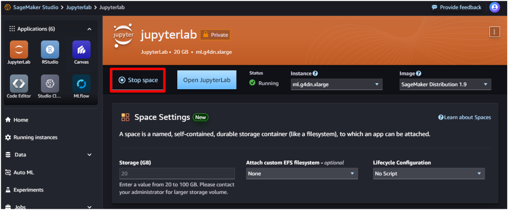

2. JupyterLab Space가 중지된 후 **Delete**를 선택합니다.

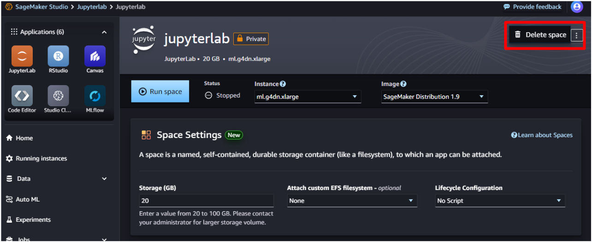

3. 도메인 세부 정보 **사용자 프로필** 탭에서 사용자 이름을 선택합니다.
우측 상단에서 **삭제**를 선택합니다.

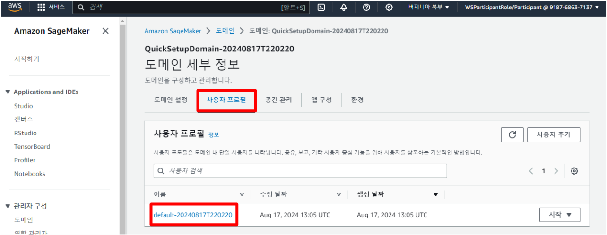
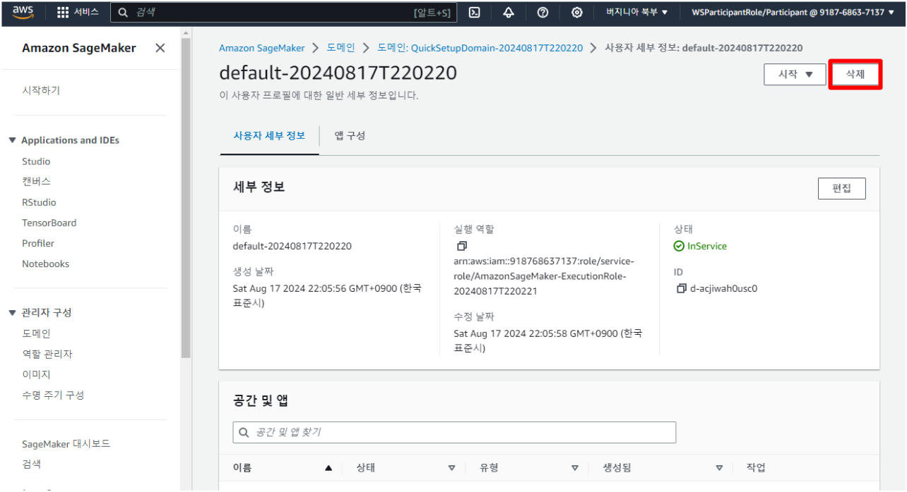

4. "**예, 사용자를 삭제합니다**"를 선택하고, 아래의 필드에 `삭제`를 입력하고, "**삭제**"를 선택합니다.

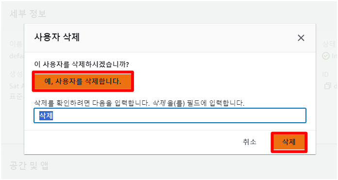

5. 도메인 세부 정보 **도메인 설정** 탭에서 사용자 이름을 선택합니다.
하단에서 **도메인 삭제**를 선택합니다.

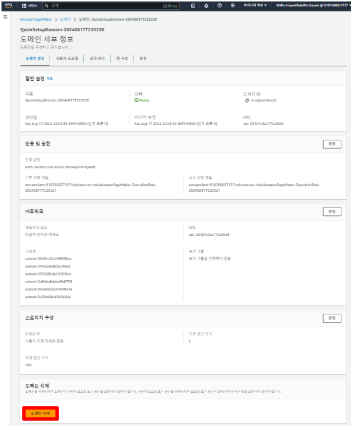

4. "**예. 도메인을 삭제합니다**"를 선택하고, 아래의 필드에 `삭제`를 입력하고, "**삭제**"를 선택합니다.

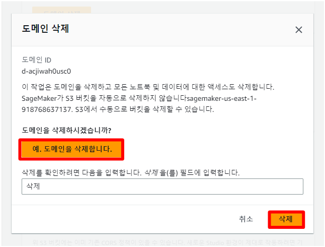
