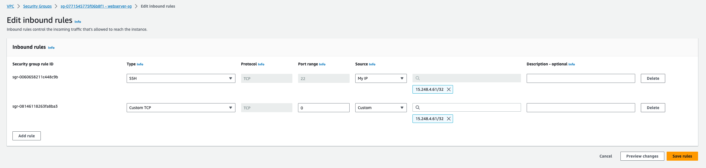

# VPC 실습
## Amazon VPC (Virtual Private Cloud) 에 대해서
Amazon Virtual Private Cloud(Amazon VPC) 를 이용하면 사용자가 정의한 가상 네트워크로 AWS 리소스를 시작할 수 있습니다. 이 가상 네트워크는 AWS의 확장 가능한 인프라를 사용한다는 이점과 함께 고객의 자체 데이터 센터에서 운영하는 기존 네트워크와 매우 유사합니다.

Amazon VPC를 사용하면 사용자가 정의하는 논리적으로 격리된 가상 네트워크에서 AWS 리소스를 시작할 수 있습니다. IP 주소 범위 선택, 서브넷 생성, 라우팅 테이블 및 네트워크 게이트웨이 구성 등 가상 네트워킹 환경을 완벽하게 제어할 수 있습니다. 리소스 및 애플리케이션에 대한 안전하고 쉬운 액세스를 보장하도록 지원하기 위해 IPv4 및 IPv6를 가상 사설 클라우드 내 대개의 리소스에 대해 사용할 수 있습니다.

아래의 순서 대로 실습을 진행하면서 네트워크를 직접 구성합니다:

1. VPC 생성하기
2. 추가 서브넷 생성하기
3. 라우팅 테이블 편집하기
4. 보안 그룹 생성하기
5. 실습 자원 삭제

---

# VPC 생성하기
## VPC 생성
1. VPC 콘솔에 로그인 합니다.
2. 아래의 화면에서 Create VPC을 클릭하여 VPC 생성을 시작합니다. **Create VPC**를 통해 VPC 구성을 손쉽게 생성할 수 있습니다.

    

3. VPC 설정에서 **VPC,서브넷 등**을 선택합니다. 이름의 경우 **VPC-Lab** 으로 작성합니다. CIDR 블록은 기본값인 **10.0.0.0/16** 으로 설정합니다. 

    

4. 가용 영역(AZ) 는 1개를 선택하고, 가용 영역은 **ap-northeast-2a** 로 선택합니다. 이 가용영역은 아까 설정했던 VPC 의 부분집합 입니다. 밑에 있는 퍼블릭 서브넷 수도 1개로 선택하고, CIDR 블록을 **10.0.10.0/24** 로 설정합니다. 프라이빗 서브넷은 만들지 않으므로, 0개를 선택합니다.이후 다른 것은 선택하지 않고, 우측 하단의 **VPC 생성** 버튼을 누릅니다.

    

> VPC IPv4 CIDR 블록 값을 지정할 때에는 향후 직접 연결할 가능성이 있는 네트워크와 주소가 중복되지 않도록 할당하는 것이 중요합니다. 또한, 향후 확장을 고려하여 충분히 큰 주소를 할당합니다.

5. 생성이 완료되면 **VPC-Lab-vpc** 이름의 VPC 를 볼 수 있습니다. 이를 **VPC-Lab** 으로 이름을 변경해 줍니다. 

    

6. 서브넷 화면에 들어가서 방금 서브넷 이름도 **public subnet A** 로 변경해 줍니다. 

    

7. 현재까지의 아키텍처 구성은 아래와 같습니다.

    

## CIDR 주소 범위 이해하기
CIDR(Classless Inter-Domain Routing)은 네트워크의 주소와 크기를 표현하는 방식 중 하나입니다. 위의 실습에서 생성한 VPC는 16을 서브넷 값으로 하는 IP 주소 범위입니다. 각 자원에 줄 수 있는 IP 갯수는 2의 16승인 65,536개입니다. 

    

VPC CIDR 블록을 지정할 때, 허용된 블록 크기는 /16 넷 마스크 (사용 가능한 IP 주소 65,536개)~ /28 넷 마스크(사용 가능한 IP 주소 16개)입니다. 각 서브넷 CIDR 블록에서 첫 4개의 IP 주소와 마지막 IP 주소는 사용자가 사용할 수 없으므로 인스턴스에 할당할 수 없습니다.

    

---
# 추가 서브넷 생성하기
## 추가 서브넷 생성하기

고가용성을 확보하기 위해, 다중 가용 영역에 서비스를 배포하는 것이 중요합니다. 따라서 본 실습에서는 앞에서 생성한 서브넷이 위치한 가용 영역 A 외에 다른 가용 영역인 C에 서브넷을 생성합니다.

1. 왼쪽 사이드 바에서 **서브넷** 메뉴를 클릭한 후, **서브넷 생성** 버튼을 클릭합니다. 

    

2. VPC ID에는 방금 생성한 VPC를 선택합니다. 

    

3. 아래의 **서브넷 설정**에서는 화면과 같이 값을 입력한 후, **서브넷 생성** 버튼을 클릭합니다. 

    

    |키|값|
    |------|---|
    |서브넷 이름|public subnet C|
    |가용 영역|ap-northeast-2c|
    |IPv4 CIDR 블록|10.0.20.0/24|
    |Name|public subnet C|

4. **public subnet A**와 **public subnet C**가 모두 생성된 것을 확인할 수 있습니다. 

    

5. 현재까지의 아키텍처 구성은 아래와 같습니다. 

    

---

# 라우팅 테이블 편집하기
## VPC 라우팅 테이블 개념

**라우팅 테이블**에는 서브넷 또는 게이트 웨이의 네트워크 트래픽이 전송되는 위치를 결정하는데 사용되는 **라우팅**이라는 규칙 집합이 포함되어 있습니다.

- **기본 라우팅 테이블**은 VPC와 함께 자동으로 생성되는 라우팅 테이블입니다. 다른 라우팅 테이블과 명시적으로 연결되지 않은 모든 서브넷의 라우팅을 제어하는 역할을 합니다.
- **사용자 지정 라우팅 테이블**은 기본 라우팅 테이블 외에 사용자가 생성한 라우팅 테이블입니다.

## 라우팅 테이블 편집하기

1. 서브넷 메뉴에서 작업 버튼을 클릭한 후, 라우팅 테이블 연결 편집을 선택합니다. 

    

2. 라우팅 테이블 ID에서 기본 라우팅 테이블이 아닌 다른 라우팅 테이블을 선택한 후, 저장합니다. 이때, 선택한 라우팅 테이블에 인터넷으로 향하는 경로가 있는지 확인합니다. 

    

3. **public subnet C**를 선택한 후, 세부 정보 탭에서 변경된 라우팅 테이블 하이퍼 링크를 클릭하면 라우팅 정보를 확인할 수 있습니다. 

    

    라우팅 테이블을 클릭 후, 라우트 탭에서 확인할 수 있는 결과는 아래와 같습니다. 이를 통해, public subnet C도 인터넷으로 향하는 경로가 생성되었음을 확인할 수 있습니다.

    |Destination|Target|
    |------|---|
    |10.0.0.0/16|local|
    |0.0.0.0/0|igw-OOO|

4. 현재까지의 아키텍처 구성은 아래와 같습니다. 

    

---
# 보안 그룹 생성하기
## 보안 그룹 생성하기

보안 그룹은 인스턴스에 대한 인바운드 및 아웃바운드 트래픽을 제어하는 가상 방화벽 역할을 합니다.

1. 왼쪽 사이드 바에서 **보안 그룹** 메뉴를 클릭한 뒤, **보안 그룹 생성** 버튼을 클릭합니다. 

    

2. 화면과 같이 보안 그룹 및 설명을 입력한 후, **본 실습에서 생성한 VPC**를 선택합니다. 

    

    |키|값|
    |------|---|
    |보안 그룹 이름|`webserver-sg`|
    |설명|`security group for web servers`|
    |VPC|`VPC-Lab`|

3. **인바운드 규칙**에서 아래와 같이 규칙을 부여한 후, 오른쪽 하단의 **보안 그룹 생성** 버튼을 클릭합니다. 

    

    |유형|소스|
    |------|---|
    |HTTP| Custom(MyIP): [/32로 끝나는 사설 IP 주소 기입] (현재 사용중인 로컬 IP 주소는 여기서 확인할 수 있습니다. [What is my IP.](https://www.google.com/search?q=What+is+my+ip%3F&rlz) )|
    |SSH|Custom(MyIP): [/32로 끝나는 사설 IP 주소 기입] (현재 사용중인 로컬 IP 주소는 여기서 확인할 수 있습니다. [What is my IP.](https://www.google.com/search?q=What+is+my+ip%3F&rlz) )|

4. 아래와 같이 인바운드 규칙이 생성된 것을 확인합니다. 

    

---

# 실습 자원 삭제하기
## 실습 자원 삭제하기

VPC 콘솔 **VPC** 메뉴에서 오늘 생성한 VPC를 선택한 후, **작업** 메뉴에서 **VPC 삭제**를 클릭하여 삭제합니다 

